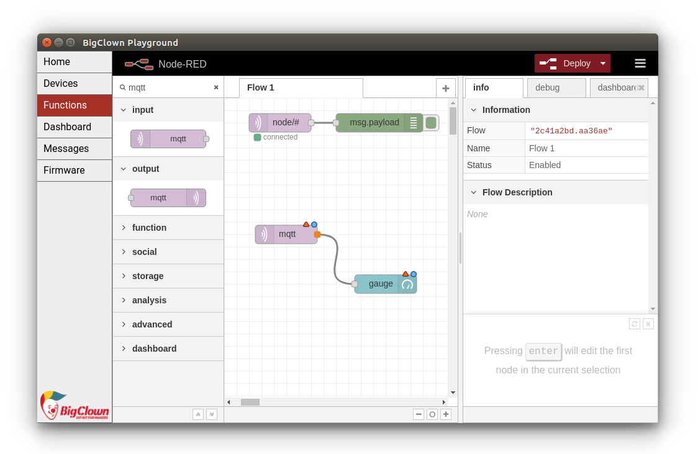
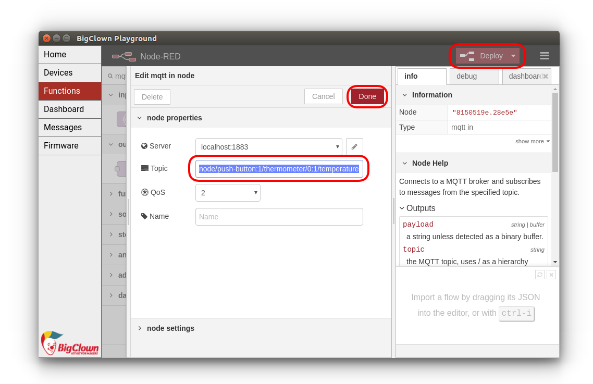
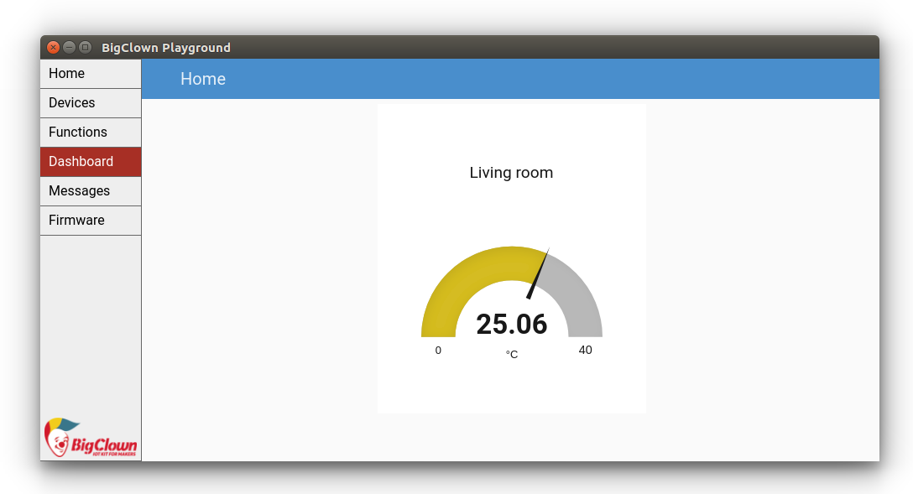

# Quick Start Guide

## Thank You, Dear Maker!

If you are reading this QUICK START GUIDE you have probably purchased our HARDWARIO IoT Kit. If not, go [shopping](https://shop.bigclown.com/) to do so :\)

Once again **THANK YOU** for being our supporter, we really appreciate this.

HARDWARIO is not just about the hardware but it comes with full documentation, tutorials, software tools and most importantly - it comes with the extensive **technical support**. SHARDWARIOo don't hesitate to use one of these channels In case you run in troubles or if anything is not clear to you:

* Write us an email to [ask@hardwario.com](mailto:ask@hardwario.com)
* Use forum at [https://forum.bigclown.com/](https://forum.bigclown.com/)
* Use the online chat icon in the bottom right corner

## Be Inspired

It's always hard to build something without an inspiration. We motivate our makers to share their work with others and you can get ideas for your projects by [subscribing to our Clownsletter](http://eepurl.com/drGLGf).

## Get Ready

In our world it means to prepare a center of your IoT system - the Hub. In QUICK START GUIDE we will use your computer as a Hub. Just follow these steps:

### 1. Delivery

In delivered box or suitcase find a **Radio Dongle** and plug it to any USB port of your computer.

### 2. Download the latest Playground

Go to the [HARDWARIO Playground Download page](bigclown-playground.md#download-bigclown-playground).

### 3. Run the **HARDWARIO Playground**

Go to the **Device** tab, choose the **Radio Dongle** serial port and click **Connect**


If you cannot see Radio Dongle in the devices, please see the [Troubleshooting](bigclown-playground.md#troubleshooting) chapter.


Radio kits delivered together with your [Radio Dongle](https://shop.bigclown.com/radio-dongle) are already programmed and paired, please check that out in the image below.


In the future we recommend to use as a Hub our ready-to-use [Raspberry Pi](../tutorials/raspberry-pi-installation.md) or [any server](../tutorials/custom-setup-on-raspberry-pi.md#setup-on-original-raspbian) with our Radio Dongle.


## Build devices

By building devices we mean putting modules and enclosure together, optionally flashing a new firmware and pairing devices with a Radio Dongle.

Build delivered kits or build devices from modules \(check the [video guides](https://www.youtube.com/playlist?list=PLfRfhTxkuiVyc9P1TWw_DnAeh2INXwpFK) how to do so\). Do not put batteries to the battery modules yet and be careful how to connect [Mini Battery](https://shop.bigclown.com/mini-battery-module) Module from the right side.  

As mentioned, delivered kits are already programmed with a right firmware. If you would like to change it to another firmware in the Core Module, please follow this [firmware flash chapter](../integrations/homekit-and-siri.md#step-1-flash-firmware).

### 1. Radio Pairing

As mentioned, kits delivered together with Radio Dongle are already paired and should be visible in Playground's **Device** tab. In case you need to pair new devices, please follow these [radio pairing instructions](bigclown-playground.md#pairing-new-modules).

### 2. Playground's Messages

Switch to Playground's **Messages** tab and put batteries to your kit, you should see incoming messages. Every kit sends different messages. Here the **Button kit** sends _temperature, voltage, event-count_ \(everytime you press the button\) and other messages.

### 3. 3D-printed enclosure

Put modules to the 3D-printed enclosure and fix it with O-rings.

## Add function

Now it's time to give your system a logic and connect it with desired platforms.

In **QUICK START GUIDE** we will create a simple dashboard with a temperature gauge. Again, just follow these steps:

### 1. Messages

Switch to the **Messages**, you should see incoming messages from the previous step. Copy the **bold** text \(called **topic**\) that ends with _temperature_ **to the clipboard**. You can use the copy icon in each message. Make sure you copy just text and no space before or after the text. Your **topic** could be different based on your kit name. You can also copy any other topic that your module supports from the [MQTT topics list](../interfaces/mqtt-topics.md).

### 2. Function

Switch to the **Function** tab and from the color blocks on the left side drag and drop **mqtt input** block and **gauge** block to the **flow** in the middle of the screen. The color blocks are called **nodes**. You can use the `filter nodes` text box to find the right block. Connect the two created nodes together.

Double click on the **gauge** node. Change **Label**, **Units** and **Range** to your needs. Then click **Done**. Double click on the **mqtt** node and paste the previously copied topic from the clipboard. Make sure there are not any spaces before and after the copied text. Then click **Done** and **Deploy** button. You have to click on the **Deploy** everytime you make changes in your flow.

### 3. Dashboard

Go to Playground's **Dashboard** tab and you should see a gauge with the temperature of the selected device. The temperature can take a while to appear. You can breathe on the module or reconnect batteries for immediate update.

## Share

Don't be shy and share your projects with others. We will reward you by a **100 EUR** discount coupon if your project will be displayed on our web.

Or just put the red nose on, make a selfie and share it on Facebook or Twitter with a hashtag **\#Clownfie** and you will get a **10 EUR** discount coupon.

## Learn More     

The goal of this **QUICK START GUIDE** is to show the basics in a few simple steps. Now you can learn more by browsing the **documentation** or by visiting the **links below**.

* Take a look at the [Module Overview](module-overview.md).
* Learn about [MQTT](../interfaces/mqtt-topics.md) and [HARDWARIO MQTT topics](../interfaces/mqtt-topics.md) to control LEDs and relays.
* Try other [integrations](../integrations/grafana-for-visualization.md) with **Grafana**, **Blynk**, **IFTTT**, **Ubidots** and others.
* Use your [Raspberry PI](../tutorials/raspberry-pi-installation.md) or other [single board computer \(SBC\)](../tutorials/custom-setup-on-raspberry-pi.md#setup-on-original-raspbian) as a server.
* [Flash other firmware](../integrations/homekit-and-siri.md#step-1-flash-firmware) or [write your own firmware](../firmware/basic-overview.md) for the **Core Module**.
* Check the [Core Module pinouts](../hardware/header-pinout.md) and add your own buttons, relays and sensors.

## Troubleshooting     

Cannot find the Radio Dongle or Core Module in the device list

* On Windows 7 and macOS please install the [FTDI VCP drivers](https://www.ftdichip.com/Drivers/VCP.htm)
* On Ubuntu you need to be in `dialout` user group. Please use command `sudo usermod -a -G dialout $USER` and restart computer
* HARDWARIO Playground cannot flash older Core Module Revision 1. Please use the `bcf`tool. See [version comparison](../hardware/core-module-r1-and-r2-comparison.md)

