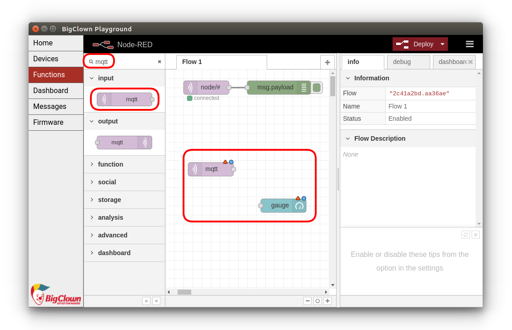
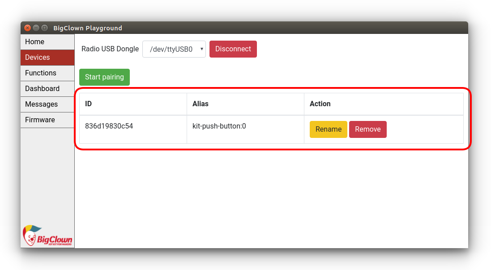
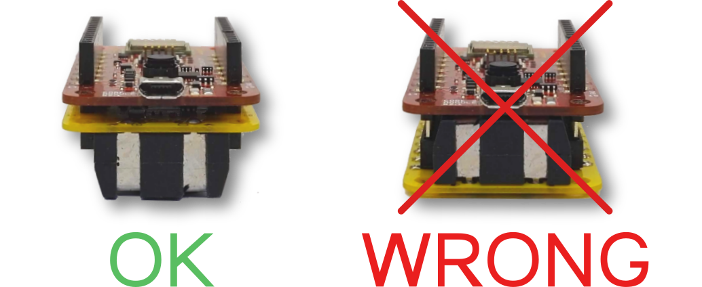
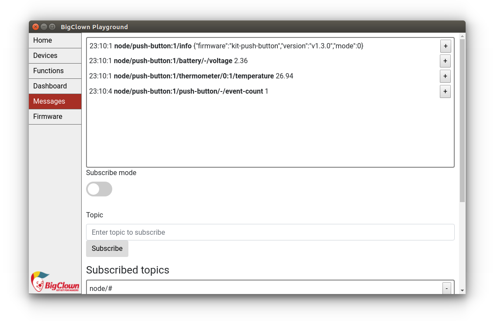

# Quick Start Guide

#### Thank You, Dear Maker!

If you are reading this QUICK START GUIDE you have probably purchased our BigClown IoT Kit. If not, go [shopping](https://shop.bigclown.com/) to do so :\)

Once again **THANK YOU** for being our supporter, we really appreciate this.

BigClown is not just about the hardware but it comes with full documentation, tutorials, software tools and most importantly - it comes with the extensive **technical support**. So don't hesitate to use one of these channels In case you run in troubles or if anything is not clear to you:

* Use the online chat icon in the bottom right corner
* Write us an email to [support@bigclown.com](mailto:support@bigclown.com)
* Use forum at [https://forum.bigclown.com/](https://forum.bigclown.com/)

### Be Inspired

It's always hard to build something without an inspiration. We motivate our makers to share their work with others and you can get ideas for your projects by [subscribing to our Clownsletter](http://eepurl.com/drGLGf).

### Get Ready

In our world it means to prepare a center of your IoT system - the Hub. In QUICK START GUIDE we will use your computer as a Hub. Just follow these steps:

1. In delivered box or suitcase find a **Radio Dongle** and plug it to any USB port of your notebook or PC.
2. Download the latest Playground:



* 32 bit:
  * [non-installable](https://github.com/bigclownlabs/bch-playground/releases/download/v0.11.0/bigclown-playground-0.11.0-windows-32bit.exe)
  * [installable](https://github.com/bigclownlabs/bch-playground/releases/download/v0.11.0/bigclown-playground-0.11.0-win-setup-32bit.exe)
* 64 bit:
  * [non-installable](https://github.com/bigclownlabs/bch-playground/releases/download/v0.11.0/bigclown-playground-0.11.0-windows-64bit.exe)
  * [installable](https://github.com/bigclownlabs/bch-playground/releases/download/v0.11.0/bigclown-playground-0.11.0-win-setup-64bit.exe)



* [DMG](https://github.com/bigclownlabs/bch-playground/releases/download/v0.11.0/bigclown-playground-0.11.0-macos.dmg)



* DEB:
  * [amd64](https://github.com/bigclownlabs/bch-playground/releases/download/v0.10.1/bigclown-playground-0.10.1-linux-amd64.deb)
  * [i386](https://github.com/bigclownlabs/bch-playground/releases/download/v0.10.1/bigclown-playground-0.10.1-linux-i386.deb)
* .tar.gz:
  * [ia32](https://github.com/bigclownlabs/bch-playground/releases/download/v0.10.1/bigclown-playground-0.10.1-linux-ia32.tar.gz)
  * [x64](https://github.com/bigclownlabs/bch-playground/releases/download/v0.10.1/bigclown-playground-0.10.1-linux-x64.tar.gz)
* AppImage:
  * [x86\_64](https://github.com/bigclownlabs/bch-playground/releases/download/v0.10.1/bigclown-playground-0.10.1-linux-x86_64.AppImage)



3. Run the **BigClown Playground**, go to the **Device** tab, choose the **Radio Dongle** serial port and click **Connect**


If you cannot see Radio Dongle in the devices, please see the [Troubleshooting](https://www.bigclown.com/doc/basics/quick-start-guide/#troubleshooting) chapter.


4. Radio kits delivered together with your [Radio Dongle](https://shop.bigclown.com/radio-dongle) are already programmed and paired, please check that out in the image below.


In the future we recommend to use as a Hub our ready-to-use [BigClown Hub](https://shop.bigclown.com/bigclown-hub)or just plug our Radio Dongle to [Raspberry Pi](https://www.bigclown.com/doc/tutorials/raspberry-pi-installation/) or [any server](https://www.bigclown.com/doc/tutorials/custom-setup-on-raspberry-pi/#setup-on-original-raspbian).


### Build devices

By building devices we mean putting modules and enclosure together, optionally flashing a new firmware and pairing devices with a Radio Dongle.

**QUICK START GUIDE** recommends to follow this steps:

1. Build delivered kits or build devices from modules \(check the [video guides](https://www.youtube.com/playlist?list=PLfRfhTxkuiVyc9P1TWw_DnAeh2INXwpFK) how to do so\). Do not put batteries to the battery modules yet and be careful how to connect [Mini Battery](https://shop.bigclown.com/mini-battery-module) Module from the right side.

2. As mentioned, delivered kits are already programmed with a right firmware. If you would like to change it to another firmware in the Core Module, please follow this [firmware flash chapter](https://www.bigclown.com/doc/projects/radio-door-sensor/#flash-door-sensor-firmware).

3. As mentioned, kits delivered together with Radio Dongle are already paired and should be visible in Playground's **Device** tab. In case you need to pair new devices, please follow these [radio pairing instructions](https://www.bigclown.com/doc/projects/radio-door-sensor/#pair-the-radio-door-sensor).

4. Switch to Playground's **Messages** tab and put batteries to your kit, you should see incoming messages. Every kit sends different messages. Here the **Button kit** sends _temperature, voltage, event-count_ \(everytime you press the button\) and other messages.

5. Put modules to the 3D-printed enclosure and fix it with O-rings.

