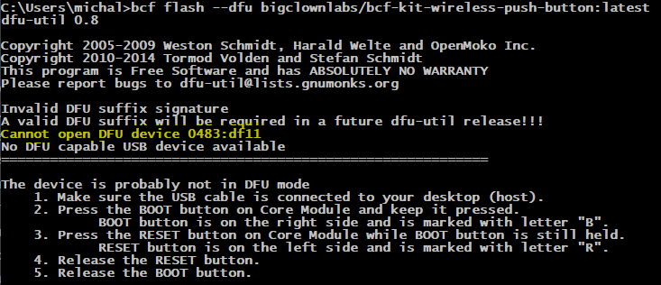
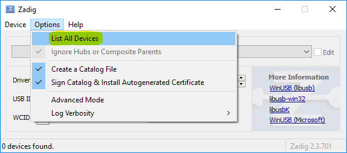
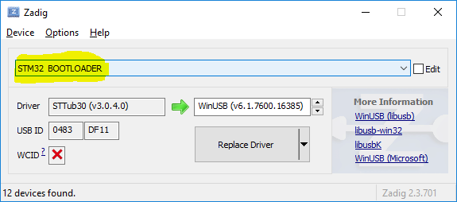
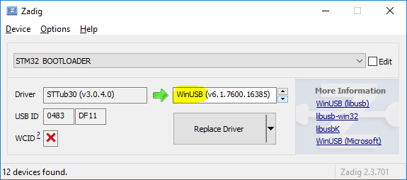
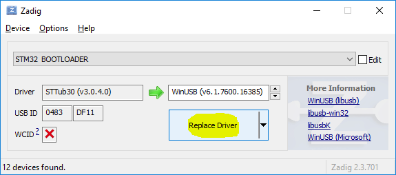
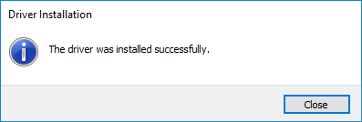

# Toolchain Guide


This document assumes that you have necessary tools installed according to the document [**Toolchain Setup**](toolchain-setup.md).



All of the steps below assume work with **BigClown Toolchain** in Windows or with the **Terminal** application in macOS or Ubuntu.


## Program BigClown Firmware Tool

The program BigClown Firmware Tool \(**bcf**\) simplifies the firmware workflow.

This tool allows to:

* Manipulate with firmware packages:
  * Update package database \(`bcf update`\)
  * Listing from package database \(`bcf list`\)
  * Search in package database \(`bcf search`\)
  * Download package for offline use \(`bcf pull`\)
* Upload firmware \(`bcf flash`\)
* Create empty project for firmware development \(`bcf create`\)

We will show the individual operations in the following chapters.


BigClown projects offer pre-compiled firmware binary images in the section **Releases** of the given GitHub repository.


The **bcf** tool has a built-in help system. You can see the basic list of commands by using `bcf help`:

```text
usage: bcf [-h] [-v] COMMAND ...

BigClown Firmware Tool

positional arguments:
  COMMAND
    update       update list of available firmware
    list         list firmware
    flash        flash firmware
    devices      show devices
    search       search in firmware names and descriptions
    pull         pull firmware to cache
    clean        clean cache
    create       create new firmware
    read         download firmware to file
    help         show help

optional arguments:
  -h, --help     show this help message and exit
  -v, --version  show program's version number and exit
```

Detailed usage of a given command using e.g. `bcf help flash`:

```text
usage: bcf flash
       bcf flash <firmware>
       bcf flash <file>
       bcf flash <url>

optional arguments:
  -h, --help            show this help message and exit
  --device {/dev/ttyUSB0}
                        device
  --dfu                 use dfu mode
```


[Device Firmware Upgrade](https://en.wikipedia.org/wiki/USB#Device_Firmware_Upgrade) \(DFU\) is a vendor- and device-independent mechanism for upgrading the firmware of USB devices


## Firmware Package Listing

Use this command to update the list of available firmware packages:

```text
bcf update
```


Always use this command before listing the available packages.


Use this command to list the available firmware packages:

```text
bcf list
```

Example output:

```text
...
bigclownlabs/bcf-gateway-usb-dongle:v1.10.0
bigclownlabs/bcf-radio-climate-monitor:v1.3.0
bigclownlabs/bcf-radio-co2-monitor:v1.4.0
bigclownlabs/bcf-radio-door-sensor:v0.2.0
bigclownlabs/bcf-radio-flood-detector:v1.3.0
bigclownlabs/bcf-radio-lcd-thermostat:v1.4.0
bigclownlabs/bcf-radio-motion-detector:v1.3.0
bigclownlabs/bcf-radio-power-controller-rgb150:v1.4.1
bigclownlabs/bcf-radio-power-controller-rgbw144:v1.4.1
bigclownlabs/bcf-radio-power-controller-rgbw36:v1.4.1
bigclownlabs/bcf-radio-power-controller-rgbw72:v1.4.1
bigclownlabs/bcf-radio-push-button:v1.3.0
bigclownlabs/bcf-radio-voc-sensor:v1.0.0
...
```

Use this command to list all the versions of the available firmware packages:

```text
bcf list --all
```

Use this command to search in the available packages \(in their title and description\):

```text
bcf search <searched term>
```

## Firmware Upload

There are two bootloaders in MCU ROM:

* DFU - in case of USB device in MCU is used \(e.g. for Core Module R1.3\)
* UART - in case of USB-UART chip device is used \(e.g. for Radio Dongle or Core Module R2.x\)


In case you need to upload the firmware into the Core Module R1, you must first [**put it in the DFU mode**](toolchain-guide.md#switching-core-module-into-dfu-mode). Moreover, the flash command must be in the `bcf flash --device dfu` format.



**Flashing Core Module R1 & R2**  
For differences of flashing older **Core Module 1** and newer **Core Module 2** please read **Core Module R1 and R2 comparison** in the **Hardware section**


Firmware upload can be done using the `bcf flash` command. The firmware can be obtained from 3 different sources:

### Step 1: Source **firmware package**, for instance

```text
bcf flash bigclownlabs/bcf-radio-push-button:latest
```

### Step 2: Source **local disk file**, for instance

```text
bcf flash firmware.bin
```

### Step 3: Source **file from the specified URL**, for instance

```text
bcf flash https://github.com/bigclownlabs/bcf-radio-push-button/releases/download/v1.1.0/bcf-radio-push-button-v1.1.0.bin
```

You can list the USB UART devices connected to your host using this command:

```text
bcf devices
```

...and then use the device from the list altogether with the `--device` parameter, e.g.:

```text
bcf flash --device /dev/ttyUSB0 bigclownlabs/bcf-gateway-usb-dongle:latest
```

this way the `bcf` will not ask you which serial port to use every time.

## Firmware Package Cache

If the firmware does not exist in the local cache, it is download first with the first `bcf flash` command.

Also, if you need to download the firmware package and work with it later offline, you can download it using the `bcf pull` command, for instance:

```text
bcf pull bigclownlabs/bcf-gateway-usb-dongle:latest
```

If you want to clean the cache of the firmware package list and all the downloaded packages, use this command:

```text
bcf clean
```

## Create Blank Firmware Project

### Step 1: Go to the directory where you want to create a firmware directory

### Step 2: Go to the directory where you want to create a firmware directory

```text
bcf create <firmware-name>
```

### Step 3: The **bcf** program cloned the basic firmware skeleton, which is ready to build immediately \(see description below\)


The starting point for developing your own firmware is the file `app/application.c`.


## Build Firmware

Firmware build is done using the traditional traditional build system **GNU Make**, which follows the recipe given in the file `Makefile` \(found in the firmware root directory\).

There are 2 target configurations to build the firmware:

* `debug`

  This configuration is implicit and is suitable for firmware development. The built-in firmware is ready for debugging.

* `release`

  This configuration is suitable for final deployment. It has build some optimizations turned on and is not suitable for firmware debugging due to these optimizations. The resulting program in this configuration can run faster and show lower power consumption than the one in `debug` configuration.

You can build the firmware by following these steps:

### Step 1: Go to the firmware directory you want to build

### Step 2: Run the build command

```text
make
```


Build process can be accelerated by specifying the number of parallel compiler processes through the parameter `-j<number>`. The number should match the number of cores in your processor. Example: `make -j4`


### Step 3: Upon **successful completion** of the build process, you will receive a similar listing at the end

```text
Linking object files...
Size of sections:
   text    data     bss     dec     hex filename
  74332    2776    7328   84436   149d4 out/debug/firmware.elf
Creating out/debug/firmware.bin from out/debug/firmware.elf...
```

### Step 4: The program called **linker** created two important files

* `out/debug/firmware.elf`

  This is the file in ELF format containing symbols necessary for a debugger.

* `out/debug/firmware.bin`

  This is the binary image necessary for programming \(the ELF file also contains this binary image\).

### Step 5: In order to build the firmware in `release` configuration, use this command

```text
make release
```

This command generates the file `out/release/firmware.bin`.

## Switching Core Module into DFU Mode

To program the **Core Module**, we must first enter the DFU mode.

We can do this by following this procedure:

### Step 1: Check that the USB cable is plugged into the **Core Module** and your computer

### Step 2: Press and hold the **BOOT** button on the **Core Module**


The **BOOT** button is on the right and is marked with a letter `B`.


### **Step 3:** Press and release the **RESET** button on the **Core Module**. At this point, you still have to hold the **BOOT** button


The **RESET** button is on the left and is marked with a letter `R`.


### Step 4: Release the **BOOT** button


Now the **Core Module** is connected to your computer as a DFU USB device and is ready for programming.


## Windows DFU Driver Troubleshooting

### Incorrect DFU Driver

In case you get `Cannot open DFU device 0483:df11` while running the **bcf flash --device dfu** command, you have the incorrect DFU drivers installed.



#### Step 1: Execute `zadig` from Toolchain or Playground shell \(from `cmd.exe` BigClown window\)


Keep the **Core Module** connected with the DFU mode activated.


#### Step 2: Allow admin rigths in the User Acess Control pop-up

#### Step 3: Select Options -&gt; List All Devices



#### Step 4: Choose **STM32 BOOTLOADER**



#### **Step 5:** Choose **WinUSB**



#### Step 6: Click on **Replace Driver**




You will get The driver was installed successfully notification.




#### **Step 7:** Exit **Zadig** and get back to firmware flashing. The DFU driver repair procedure is finished

#### Step 8: You can check DFU readiness using the `dfu-util -l` command from **BigClown Toolchain Prompt**


### No DFU Device Found

There is not `Cannot open DFU device 0483:df11` between:

```text
A valid DFU suffix will be required in a future dfu-util release!!!
No DFU capable USB device available
```


There can be various reasons:

#### **Step 1:** DFU mode is not activated on the **Core Module**

Follow the instructions in the chapter [**Switching Core Module into DFU Mode**](toolchain-guide.md#switching-core-module-into-dfu-mode).

#### Step 2: Defective USB cable, USB hub, USB port or **Core Module**

* Try different hardware.
* Try connection without a USB hub.
* Make sure the USB cable used has data wires \(some USB cables are for powering only\).

#### **Step 3:** Connection mismatch - the **Core Module** is connected to different host than where **bcf** is executed

* Connect the **Core Module** to the right host.

## Related Documents

* [**Toolchain Setup**](toolchain-setup.md)

