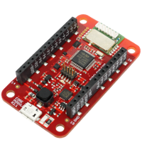
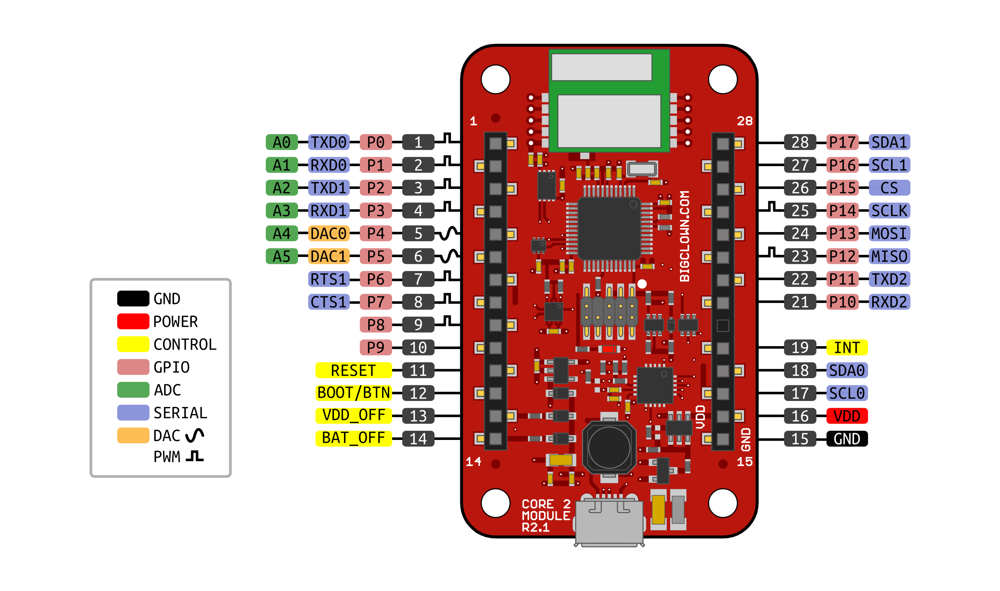

# About Core Module


**Flashing Core Module R1 & R2**  
For differences of flashing older **Core Module 1** and newer **Core Module 2**please read **Core Module R1 and R2 comparison** in the **Hardware section**


The **Core Module** is the key element of every **BigClown** node. It has a **32-bit ARM microcontroller** with 192 kB of flash memory and 20 kB of RAM. Besides the **integrated sub-GHz radio** for the 868/915 MHz band, it also features a digital temperature sensor, 3D accelerometer, and security chip.

| \*\*\*\*[**E-shop**](https://shop.bigclown.com/core-module)\*\*\*\* | [**Schematic Drawing**](https://github.com/bigclownlabs/bc-hardware/tree/master/out/bc-module-core) |
| :---: | :---: |

Core Module **R2** is the new revision. It has added **FTDI FT231XQ** chip which allows faster flashing and no need to press buttons for DFU mode. This **FTDI** chip is acting as a USB to UART bridge and is connected to UART2. This way you can use it during debugging or logging using the **bc\_log\_\*** functions.

You can upload firmware by a Micro USB cable using the **BigClown Firmware Tool** \(works on Windows, macOS, and Linux\). It is easy to start development on this platform using the **BigClown Firmware SDK** \(Software Development Kit\). The SDK offers clean and consistent APIs which allow event-driven programming. These APIs are designed for **low-power and battery-operated applications**. If you need to debug your application and the logging API is not sufficient, you can use an SWD debugger and the onboard 10-pin connector.

The **Core Module** can communicate wirelessly with another **Core Module**, or you can create your wireless network using the **Radio Dongle**.

### GPIO Pin Mapping 

Table below explains mapping between pin numbers and real [STM32L083CZ](http://www.st.com/en/microcontrollers/stm32l083cz.html) GPIO pin names:

| Pin | Signal | MCU Pin | 5 V tolerant |
| :--- | :--- | :--- | :--- |
| 1 | P0/A0/TXD0 | PA0 \(10\) | - |
| 2 | P1/A1/RXD0 | PA1 \(11\) | Yes |
| 4 | P3/A3/RXD1 | PA3 \(13\) | Yes |
| 3 | P2/A2/TXD1 | PA2 \(12\) | Yes |
| 5 | P4/A4/DAC0 | PA4 \(14\) | - |
| 6 | P5/A5/DAC1 | PA5 \(15\) | - |
| 7 | P6/RTS1 | PB1 \(19\) | Yes |
| 8 | P7/CTS1 | PA6 \(16\) | Yes |
| 9 | P8 | PB0 \(18\) | Yes |
| 10 | P9 | PB2 \(20\) | Yes |
| 21 | P10/RXD2 | PA10 \(31\) | Yes |
| 22 | P11/TXD2 | PA9 \(30\) | Yes |
| 23 | P12/MISO | PB14 \(27\) | Yes |
| 24 | P13/MOSI | PB15 \(28\) | Yes |
| 25 | P14/SCLK | PB13 \(26\) | Yes |
| 26 | P15/CS | PB12 \(25\) | Yes |
| 27 | P16/SCL1 | PB8 \(45\) | Yes |
| 28 | P17/SDA1 | PB9 \(46\) | Yes |

* Maximum current for a single pin is 16 mA.
* Maximum current fo all GPIOs combined is 90 mA.

### Features 

* ARM Cortex M0+ 32-bit MCU STM32L083CZ \(ST\)
* 192 kB Flash / 20 kB RAM
* Radio module \(868/915 MHz\) based on SPIRIT1 \(ST\)
* Security chip ATSHA204A \(Microchip\)
* Digital temperature sensor TMP112 \(TI\)
* 3-axis accelerometer LIS2DH12 \(ST\)
* Red color LED
* Push button RESET and BOOT \(BOOT is available to MCU\)
* Easily programmable via USB \(DFU bootloader\)
* 10-pin SWD connector for debugging
* Micro-USB for host communication and/or power
* 18x GPIO \(completely free for application\)
* 3x UART, 2x I²C, 1x SPI, 5x ADC, 2x DAC
* Deep sleep mode: &lt; 5 µA
* Operating voltage range: 2.0 V to 3.6 V
* Operating temperature range: -20 to 70 °C
* Mechanical dimensions: 33 x 55 mm

### Resources 

* [**Pinout signals**](header-pinout.md)
* [**Documentation**](about-core-module.md)
* [**Schematic drawing**](https://github.com/bigclownlabs/bc-hardware/tree/master/out/bc-module-core)

### Firmware Projects 

* [**Generic firmware**](https://github.com/bigclownlabs/bcf-generic-node/releases)
* [**BigClown gateway**](https://github.com/bigclownlabs/bcf-gateway/releases) [**\(readme\)**](https://github.com/bigclownlabs/bcf-gateway/blob/master/README.md)
* [**Radio Push Button**](https://github.com/bigclownlabs/bcf-radio-push-button/releases) [**\(documentation\)**](https://www.bigclown.com/doc/projects/radio-push-button/)
* [**Radio Climate Monitor**](https://github.com/bigclownlabs/bcf-radio-climate-monitor/releases) [**\(documentation\)**](https://www.bigclown.com/doc/projects/radio-climate-monitor/)
* [**Radio Motion Detector**](https://github.com/bigclownlabs/bcf-radio-motion-detector/releases) [**\(documentation\)**](https://www.bigclown.com/doc/projects/radio-motion-detector/)
* [**Radio Flood Detector**](https://github.com/bigclownlabs/bcf-radio-flood-detector/releases) [**\(documentation\)**](https://www.bigclown.com/doc/projects/radio-flood-detector/)
* [**Radio LCD Thermostat**](https://github.com/bigclownlabs/bcf-radio-lcd-thermostat/releases)
* [**Radio CO2 Monitor**](https://github.com/bigclownlabs/bcf-radio-co2-monitor/releases) [**\(documentation\)**](https://www.bigclown.com/doc/projects/radio-co2-monitor/)
* [**Radio Power Controller and LED strip**](https://github.com/bigclownlabs/bcf-radio-power-controller/releases) [**\(documentation\)**](https://www.bigclown.com/doc/projects/radio-smart-led-strip/)

