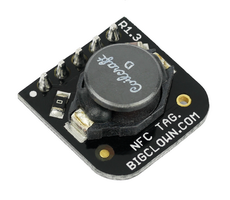

# About NFC Tag

The **NFC Tag** operates as a **dual port memory**. You have the the NFC protocol from one side and the I²C bus interface from the other side. It features a 1 kB EEPROM memory. The chip does not have to be powered when being accessed from the NFC side.

| \*\*\*\*[**E-shop**](https://shop.bigclown.com/nfc-tag)\*\*\*\* | [**Schematic Drawing**](https://github.com/bigclownlabs/bc-hardware/tree/master/out/bc-tag-nfc) | [**SDK Library**](https://sdk.bigclown.com/group__bc__tag__nfc) | [**Header File**](https://github.com/bigclownlabs/bcf-sdk/blob/master/bcl/inc/bc_tag_nfc.h) | [**Source File**](https://github.com/bigclownlabs/bcf-sdk/blob/master/bcl/src/bc_tag_nfc.c) |
| :---: | :---: | :---: | :---: | :---: |

NFC \(or Near Field Communication\) is a great technology for transferring data on a short distance \(a couple of centimeters\). This attribute makes this technology appealing for security key provisioning. Many smartphones are today equipped with the NFC technology.

### Features 

* Integrated NFC tag NT3H2111 \(NXP\)
* Communication using I²C bus
* 1 kB EEPROM memory
* Optional interrupt output
* Optional energy harvesting output
* Operating current: 240 µA
* Operating voltage range: 1.7 V to 3.6 V
* Operating temperature range: -20 to 70 °C
* Mechanical dimensions: 16 x 16 mm

### Resources 

* [**Documentation**](https://www.bigclown.com/doc/hardware/about-nfc-tag/)
* [**Schematic drawing**](https://github.com/bigclownlabs/bc-hardware/tree/master/out/bc-tag-nfc)

