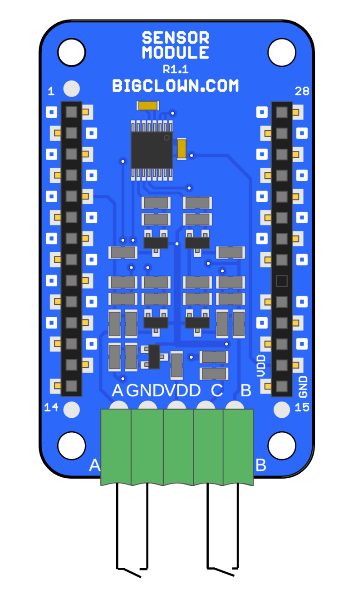
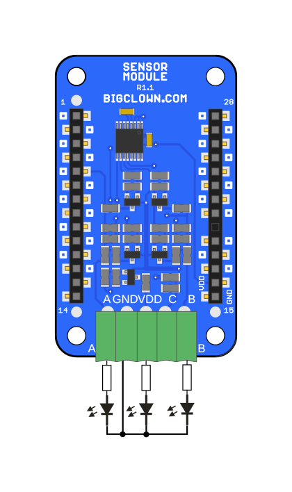

# About Sensor Module

The **Sensor Module** features **up-to four universal inputs or outputs** on a pluggable terminal block with **1-Wire bus master**support. The terminals can be used as both analog and digital input/output. For example you can connect various external digital, analog or resistive sensors. Also, you can communicate with other devices on a 1-Wire bus.

| [**E-shop**](https://shop.bigclown.com/sensor-module)\*\*\*\* | [**Schematic Drawing**](https://github.com/bigclownlabs/bc-hardware/tree/master/out/bc-module-sensor) | [**SDK Library**](https://sdk.bigclown.com/group__bc__module__sensor) | [**Header File**](https://github.com/bigclownlabs/bcf-sdk/blob/master/bcl/inc/bc_module_sensor.h) | [**Source File**](https://github.com/bigclownlabs/bcf-sdk/blob/master/bcl/src/bc_module_sensor.c) |
| :---: | :---: | :---: | :---: | :---: |

The two terminals - A on the left, B on the right - are connected to the BigClown header signals P4/A4/DAC0 and P5/A5/DAC1.

The C pin is in default configuration connected also to the ground GND. It is possible to remove zero-ohm resistor R20 and solder it to the place R21. This way the C signal is directly connected to P7 and can be used as extra input.

The VCC middle pin is possible to control by software. You can enable 3 V on this pin.

### Features 

Configurable terminal modes:

* Analog input or output
* Digital input or output
* Pull-up resistor none/4.7 kΩ/56 Ω

Examples interfaces:

* Digital temperature sensor on a 1-Wire bus \(DS18B20\)
* Resistance temperature sensor \(Pt 100, Pt 1000, etc.\)
* Analogue temperature sensor \(LM35, TMP37, etc.\)
* NTC temperature sensor
* Control of digital 1-Wire relay block
* Button or any type of switch
* Voltage measurement
* Plug-in 4-pin screw terminal block
* Operating voltage range: 1.65 V to 5.5 V
* Operating temperature range: -20 to 70 °C
* Dimensions: 33 x 55 mm

### Resources 

* [**Documentation**](https://www.bigclown.com/doc/hardware/about-sensor-module/)
* [**Schematic drawing**](https://github.com/bigclownlabs/bc-hardware/tree/master/out/bc-module-sensor)

### Firmware Projects 

* [**Radio Flood Detector**](https://github.com/bigclownlabs/bcf-radio-flood-detector/releases) [**\(documentation\)**](https://www.bigclown.com/doc/projects/radio-flood-detector/)
* [**Radio Pool Sensor**](https://github.com/hubmartin/bcf-kit-wireless-pool-sensor)

### 1-Wire Connection 

This connection is used for [Soil Moisture Sensor](https://shop.bigclown.com/soil-moisture-sensor), [DS18B20 Temperature Sensor](https://shop.bigclown.com/ds18b20-temperature-sensor/) or [Denkovi 1-Wire Relay](https://shop.bigclown.com/1-wire-8-channel-relay-module-with-din-rail-box/)

### Buttons, Magnetic Switches, Phototransistors 

This connection is used for example in [Radio Door Sensor project](https://www.bigclown.com/doc/projects/radio-door-sensor/).

### LEDs 

You can connect 3 LEDs in default configuration. \(Or up-to 4 LEDs in case of channel C rewiring\). Every LED has to have a resistor in series. All cathodes are connected to the GND pin. The channels A and B are controlled directly by setting pins P4, P5 high by using `bc_gpio` functions. The third LED connected to the VDD is controlled by `bc_module_sensor_set_vdd` function.

### Potentiometers 

Potentiometers are connected between VDD and GND. It is needed that VDD output is powered on by `bc_module_sensor_set_vdd` function. Then by using `bc_adc` you can read analog values from pins P4, P5.

