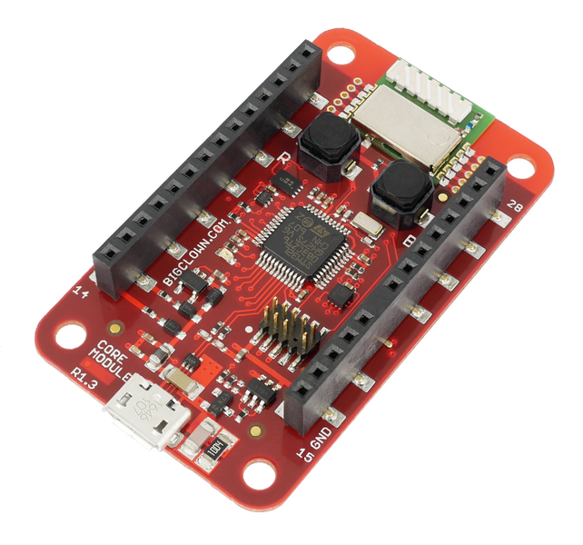
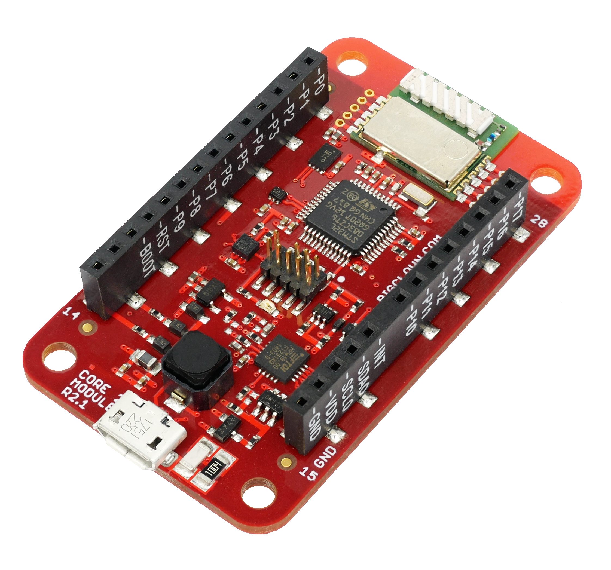

# Core Module R1 and R2 comparison

We have released the new Core Module 2. Everything is the same, only the flash process is now easier and faster.

With Core R2 you can use the [**BigClown Playground**](https://www.bigclown.com/doc/basics/quick-start-guide/) GUI tool to program nodes, manage radio network and create rules in Node-RED.

## Technical and visual differences

The most significant change is that R2 has only single button. This is the `B` button. It has moved and you can use it for your program. The `R` reset button is not necessary anymore because communication and firmware flashing is now done automatically over **FTDI** chip.

| Model | Core R1 | Core R2 |
| :--- | :--- | :--- |
| Look |  |  |

The new **Core Module 2** is not using DFU mode anymore. We have added new flashing over FTDI chip and virtual serial port over USB. This means that the flashing procedure is now the same as with the Radio Dongle. Please, use the **--device &lt;PORT&gt;** \(e.g. COM4 or /dev/ttyUSB0\) parameters instead of the former **--dfu** or **--device dfu** parameter.

## Improvements

* No need to press any button to start firmware update.
* Faster firmware uploads over **FTDI** chip
* Smaller firmwares because USB stack is now handled by **FTDI** chip.
* Simple debugging over serial port. The UART2 is connected to the FTDI so you can use [**bc\_log\_\***](http://sdk.bigclown.com/group__bc__log.html) functions.
* No issues with DFU drivers on Windows.

## Flashing Core Module R1

### Step 1: Connect the Micro USB cable to the Core Module and your computer.

### Step 2: You have to switch to [Core Module to the DFU mode](../firmware/toolchain-guide.md#switching-core-module-into-dfu-mode).

### Step 3: Upload firmware with following command

```text
bcf flash --device dfu [firmware]:[version]
```

Example which flashing wireless-motion-detector firmware from [Wireless Motion Detector](https://www.bigclown.com/doc/projects/radio-motion-detector/) project:

```text
bcf flash --device dfu bigclownlabs/bcf-radio-motion-detector:latest
```

## Flashing Core Module R2

With Core R2 you can also use the [**BigClown Playground**](https://www.bigclown.com/doc/basics/quick-start-guide/) GUI tool to program nodes, manage radio network and create rules in Node-RED.

### Step 1: Flash firmware with following command

```text
bcf flash [firmware]:[version]
```

Example which flashing wireless-motion-detector firmware from [Radio Motion Detector](https://www.bigclown.com/doc/projects/radio-motion-detector/) project:

```text
bcf flash bigclownlabs/bcf-radio-motion-detector:latest
```

### Step 2: Print bc\_log debug messages over UART2 serial to your computer with `bcf`

```text
bcf log
```

Flash firmware and immediatelly start logging after upload

```text
bcf flash [firmware]:[version] --log
```

## List of connected devices

You can also add the `--device` parameter to the `bcf` so you don't have to choose the serial port every time.

### Step 1: Run following command to see connected devices

```text
bcf devices
```

You should see as output something as following. On Windows instead of `/dev/ttyS4` will be for example `COM13`. Following device list is same on macOS and Linux.

`/dev/ttyS4`   
`/dev/ttyACM2`

### Step 2: Connect the Micro USB cable to the Core Module and your computer

Again run `bcf devices` command and you should see one added.

`/dev/ttyS4`   
`/dev/ttyUSB0`   
`/dev/ttyACM2`

Newly connected module is the `/dev/ttyUSB0`

Now you can force to use that serial port during flashing:

```text
bcf flash --device /dev/ttyUSB0 bigclownlabs/bcf-radio-motion-detector:latest
```

## References

* \*\*\*\*[**bcf tool**](../firmware/toolchain-guide.md)\*\*\*\*
* [**About Core Module**](about-core-module.md)

