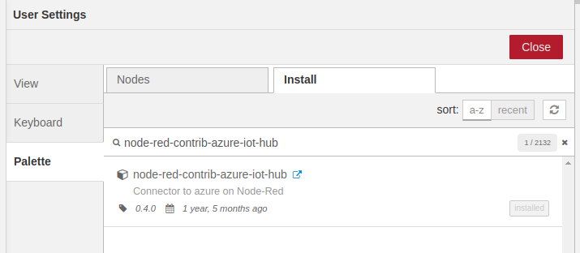

# Azure IoT Central

This guide will help you to publish data from BigClown sensors to Microsoft IoT Central and IoT Hub. This guide is based on this [Azure and Node-RED official article](https://azure.microsoft.com/es-es/blog/connecting-node-red-to-azure-iot-central/).

In [this official Azure documentation section](https://docs.microsoft.com/cs-cz/azure/iot-central/howto-generate-connection-string) you can find how to connect to IoT Central over C\#, Python, Node.js.

## Create new Device Template

Create a new [**Application** and **Device Template** in IoT Central](https://docs.microsoft.com/cs-cz/azure/iot-central/tutorial-define-device-type). You can name your device `push-button:0` so it corresponds with devices' MQTT topic alias.

In the Measurements tab add these telemetry items:

* battery
* push-button
* orientation
* thermometer

We suggest to use **exactly these names**, because in Node-RED the MQTT topics will directly transform into these names.


## Create new device in Azure IoT Central

In the Devices tab [add a new device](https://docs.microsoft.com/en-us/azure/iot-central/tutorial-add-device#add-a-real-device). Copy down the:

1. Device ID
2. Device Key \(Primary Key\)
3. Scope ID

## Connection string generation

Install nodejs tool to generate connection string. Detailed information can be found in official [Azure IoT Central documentation](https://docs.microsoft.com/en-us/azure/iot-central/tutorial-add-device#generate-the-connection-string).

You can also [download compiled binaries](https://github.com/Azure/dps-keygen/tree/master/bin) for your platform of the DPS tool.

```text
npm i -g dps-keygen
```

Then generate the connection string using the informaton from previous step

```text
dps-keygen -di:dev1 -dk:devicekeyhere -si:scopeidhere
```

* di = Device ID
* dk = Device Key \(Primary Key\)
* si = Scope ID

The tool will generate the connection string. You need to find and copy **HostName** that will be uset later in Node-RED.

## Node-RED configuration

The easiest step is to use Azure IoT Hub nodes. You need to first install them in the **Node-RED Menu &gt; Manage pallete**. If you cannot see **Manage pallete** item, you have to install npm on your system and restart Playground.

In the **Install** tab search and install `node-red-contrib-azure-iot-hub`



First, create the flow in Node-RED for your device. This example is prepared for Radio Push Button Kit. You can import the flow by copying the code below and use Menu &gt; Import &gt; Clipboard in Node-RED menu.

```text
[{"id":"b43e51eb.c3ad1","type":"azureiothub","z":"3a6acd97.009432","name":"Azure IoT Hub","protocol":"mqtt","x":800,"y":320,"wires":[["8411dd2e.57b28"]]},{"id":"8411dd2e.57b28","type":"debug","z":"3a6acd97.009432","name":"","active":false,"tosidebar":true,"console":false,"tostatus":false,"complete":"true","x":990,"y":320,"wires":[]},{"id":"e9ded786.1d5b58","type":"debug","z":"3a6acd97.009432","name":"","active":true,"tosidebar":true,"console":false,"tostatus":false,"complete":"payload.data","x":810,"y":420,"wires":[]},{"id":"74b2efcb.7b6e1","type":"mqtt in","z":"3a6acd97.009432","name":"","topic":"node/push-button:0/battery/-/voltage","qos":"2","broker":"efb90626.1e64b8","x":260,"y":240,"wires":[["3289c52f.889fca"]]},{"id":"9bec0bfc.5c1aa8","type":"mqtt in","z":"3a6acd97.009432","name":"","topic":"node/push-button:0/push-button/-/event-count","qos":"2","broker":"efb90626.1e64b8","x":290,"y":300,"wires":[["3289c52f.889fca"]]},{"id":"58e5a9fc.7c3a18","type":"mqtt in","z":"3a6acd97.009432","name":"","topic":"node/push-button:0/orientation","qos":"2","broker":"efb90626.1e64b8","x":240,"y":360,"wires":[["3289c52f.889fca"]]},{"id":"9ae2ac12.3fcc5","type":"mqtt in","z":"3a6acd97.009432","name":"","topic":"node/push-button:0/thermometer/0:1/temperature","qos":"2","broker":"efb90626.1e64b8","x":300,"y":420,"wires":[["3289c52f.889fca"]]},{"id":"3289c52f.889fca","type":"function","z":"3a6acd97.009432","name":"format","func":"fieldName = msg.topic.split(\"/\")[2];\nvalue = msg.payload;\n\nmsg.payload = {};\n\nmsg.payload.deviceId = \"\";\nmsg.payload.key = \"\";\nmsg.payload.protocol = \"mqtt\";\n\nmsg.payload.data = {};\nmsg.payload.data[fieldName] = value;\n\nreturn msg;","outputs":1,"noerr":0,"x":590,"y":320,"wires":[["b43e51eb.c3ad1","e9ded786.1d5b58"]]},{"id":"efb90626.1e64b8","type":"mqtt-broker","z":"","broker":"127.0.0.1","port":"1883","clientid":"","usetls":false,"compatmode":true,"keepalive":"60","cleansession":true,"birthTopic":"","birthQos":"0","birthPayload":"","willTopic":"","willQos":"0","willPayload":""}]
```

You should see this flow after import


## Configure nodes

In Node-RED, double click the blue **Azure IoT Hub** node and configure the hostname. This addres can be found in Connection string.

Double click on orange **format** node and paste correct **device ID** and **device key** in the JavaScript code.

Press the red **Deploy** button in the top right corner.

Now you are sending data to the Azure IoT Central. This is a simple demonstration. For better scalability the orange **function** node should also search for device name \(alias `push-button:0`\) in the MQTT topic and assign correct device ID and key. It is possible to name your device in IoT Central the same way it is named in MQTT topic so it's possible to map them 1:1.


