# Firebase


Firebase is online platform by Google, that has lots of useful functions such as Realtime Database, Cloud Messaging, Cloud Storage and many other. It hosts Google on his own servers. You can access services right from web, mobile apps or many other ways.


In our integration with BigClown we will be using Realtime Database and sends data there. You will learn how to connect and sends data to firebase from Node-RED and try real example with sending data from motion sensor.

Dependencies:

* Installed Playground or our Raspbian \([Raspbian](../tutorials/raspberry-pi-installation.md)\)
* Installed nodejs \(on our Raspbian preinstalled, other operating systems [download website](https://nodejs.org/en/download/)\)

## Install firebase plugin

### Step 1: Open command line

* Windows – cmd, Linux and macOS – Terminal, on our Raspbian login with user pi and password raspberry \([more about logging on our Raspbian](../tutorials/raspberry-pi-login.md)\)

### Step 2: Install firebase plugin to Node-RED via



Install Firebase plugin in Node-RED **Menu &gt; Manage palette** and search for `node-red-contrib-firebase`.



```text
sudo npm install -g node-red-contrib-firebase
```

```text
sudo reboot
```

Wait until system reboots.



## Open Node-RED



In BigClown Playground just open Functions tab.



Connect to your BigClown Hub via [IP adress](../tutorials/raspberry-pi-login.md#ip-adress) or [DNS name](../tutorials/raspberry-pi-login.md#dns-name).



## Create Firebase project

### Step 1: Create project

Go to website [https://console.firebase.google.com/](https://console.firebase.google.com/) and Click to "Add project". 


### Step 2: Name your project

Give your project whatever name you want, we will use for our example bigclowndemo and click Create project.

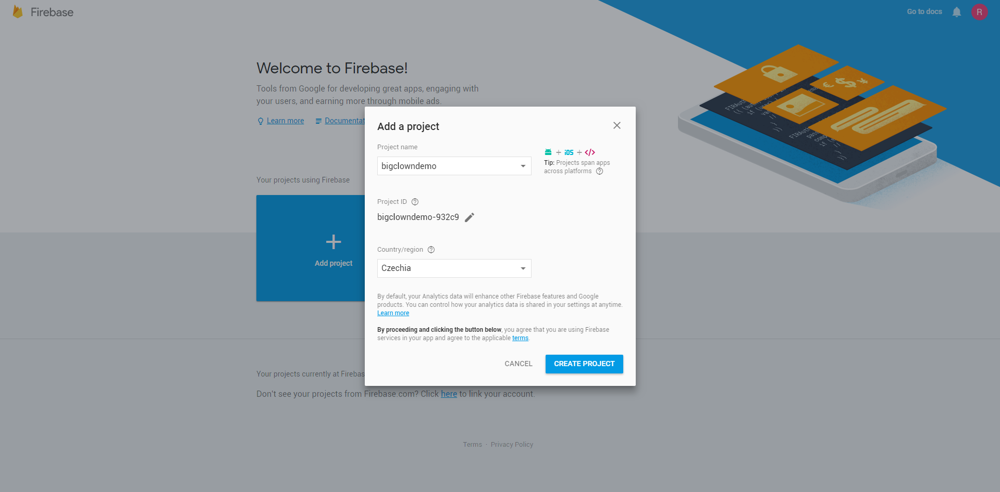

### Step 3: Click continue after Fireabse tells you that new project is ready.

### Step 4: Get started

At the bottom of your screen you will see three Cards, click “Get started” on third Card called Database.

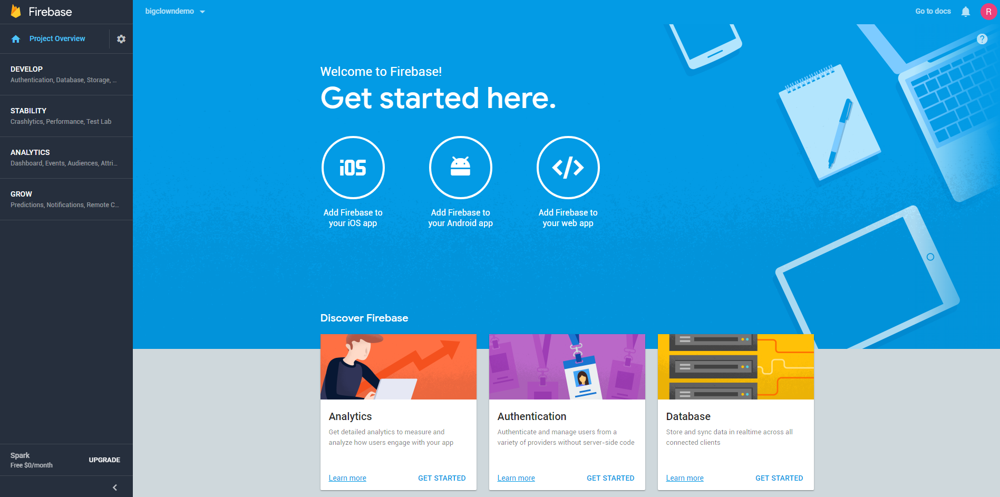

### Step 5: Choose Realtime Database

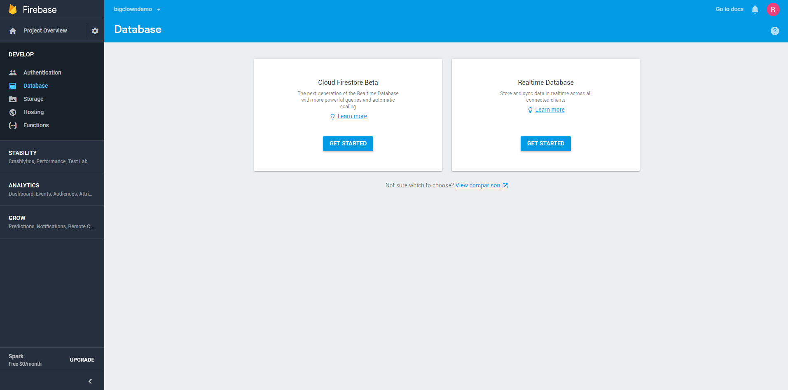

### Step 6: Database rules

For our demo, we will use choice Test mode, which is totally not secure and we recommend to change the settings of read/write rights \(you can find more about it on Firebase documentation\). However, for our demo it is sufficient. Click Enable.

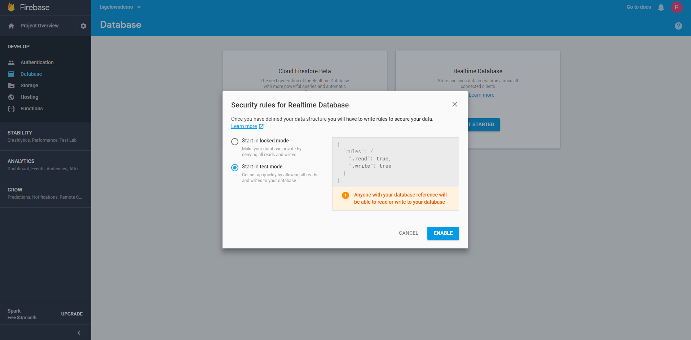

### Step 7: Finish database setting up

Now you must see database itself. Click on “dismiss” on red bar. Point on name of database and then click on plus symbol right next to name of your database. In field bellow fill Name with test, value with 0 and again click “Add” bellow. That’s all for Firebase part but keep it open. Link of your database you will need later, you can find it on top of Database card. Mine is [https://bigclowndemo-932c9.firebaseio.com/](https://bigclowndemo-932c9.firebaseio.com/).

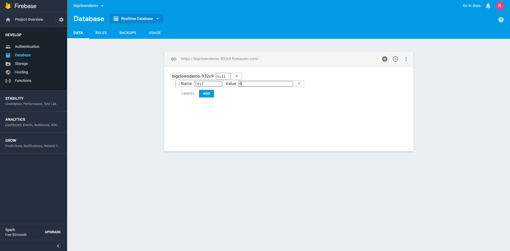

## Connect Node-RED to our Firebase project

### Step 1: Create flow

Open our Node-RED, click on "Hamburger menu" next to Deploy button &gt; Import &gt; Clipboard. Past text bellow.

```text
[{"id":"1e3fc559.61706b","type":"inject","z":"641e3ee5.52876","name":"Set 1 to Firebase","topic":"","payload":"","payloadType":"date","repeat":"","crontab":"","once":false,"onceDelay":0.1,"x":160,"y":220,"wires":[["e605003b.cc1a5"]]},{"id":"dcca267f.911ee8","type":"inject","z":"641e3ee5.52876","name":"Set 0 to Firebase","topic":"","payload":"","payloadType":"date","repeat":"","crontab":"","once":false,"onceDelay":0.1,"x":160,"y":280,"wires":[["31e96545.b948ca"]]},{"id":"e605003b.cc1a5","type":"firebase modify","z":"641e3ee5.52876","name":"Set 1 to Firebase","firebaseconfig":"","childpath":"test","method":"set","value":"1","priority":"msg.priority","x":410,"y":220,"wires":[[]]},{"id":"31e96545.b948ca","type":"firebase modify","z":"641e3ee5.52876","name":"Set 0 to Firebase","firebaseconfig":"","childpath":"test","method":"set","value":"0","priority":"msg.priority","x":410,"y":280,"wires":[[]]}]
```

### Step 2: Set up test

Double click on Firebase called “Set value to 1”, then click on pencil next to the Firebase line and fill it with your own. In my case I’ve just typed bigclowndemo-932c9, in Auth choose None, then click “Add”. Click Done on next page. Do the same on second Firebase named Set 0 to Firebase.

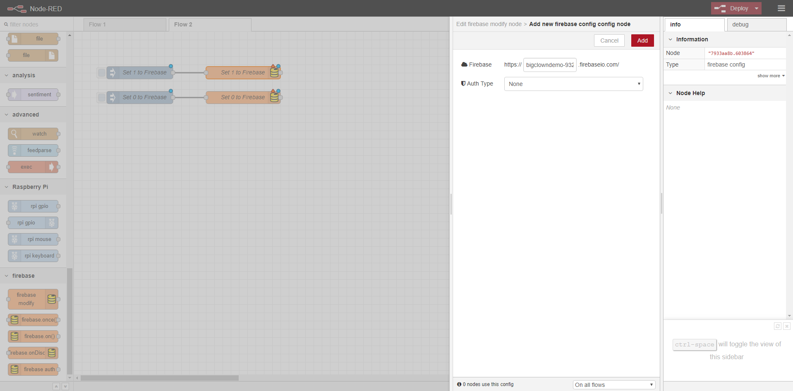

### Step 3: Test out

Click deploy. After deploying. Click on “Set 1 to Firebase”. Open your Firebase Database. You have to see 1 in test child, do the same thing with second button and you have to see 0 in child in your database.

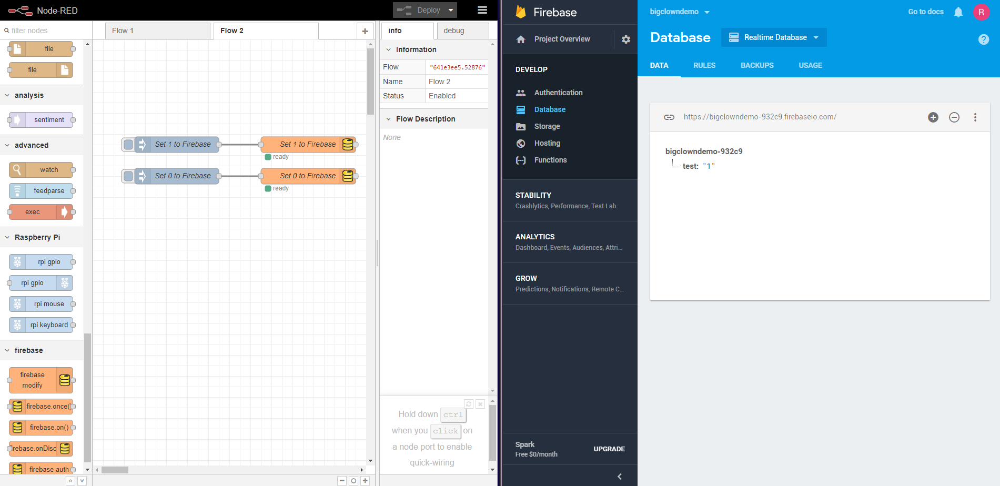

## Sends data from motion sensor to Firebase.

Dependencies:

* Had working [Wireless Motion Detector](https://www.bigclown.com/doc/projects/radio-motion-detector/) \(not IFTTT part\)

### Step 1: Had flow from [Wireless Motion Detector](https://www.bigclown.com/doc/projects/radio-motion-detector/) and check if it sends data.

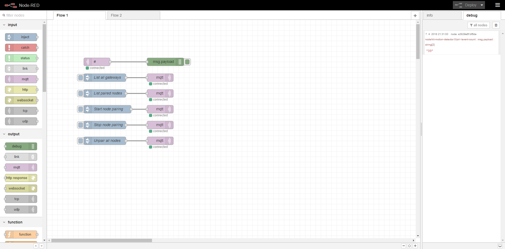

### Step 2: Make wrapper

Add mqtt in function that will take data from Motion sensor and sets there same Topic, which we can see in debug mode. This will return json information and we need to convert it.

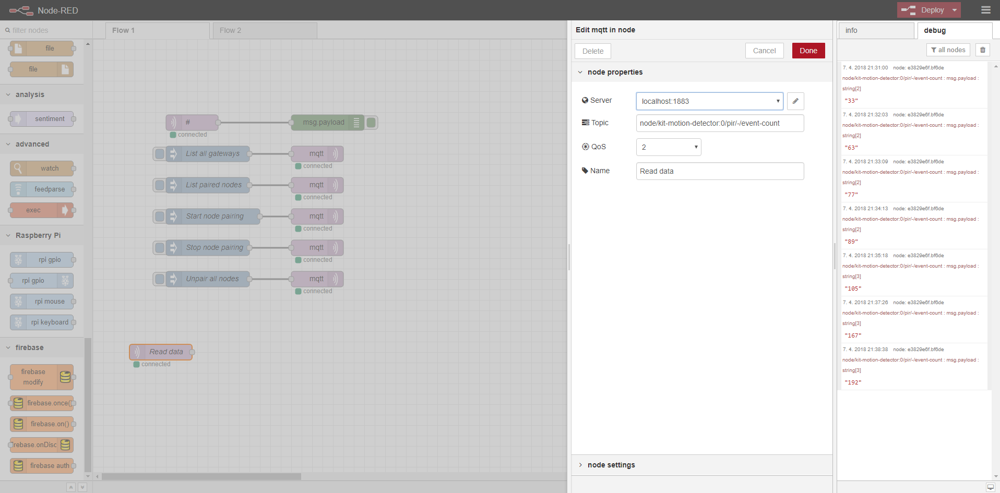

### Step 3: Make it work

For converting we will use simple function json, it is in function category. After placing json function we place firebase modify function, which sends our number of motions to firebase. Sets your Firebase like you can read in previous parts. Value msg.payload is there because json save behave this method value from mqtt in function.

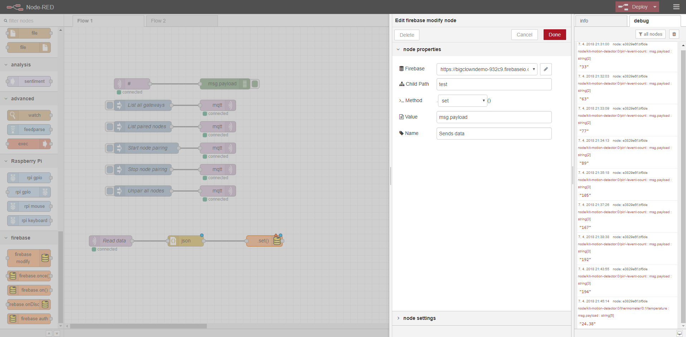

### Step 4: Finish

Click deploy and you should see number of motions in firebase.

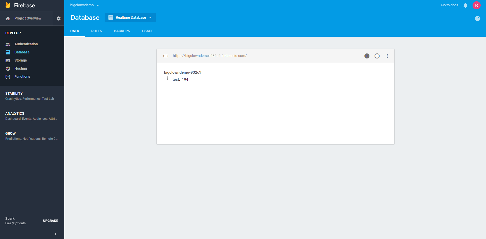

## Conclusion

You can use Firebase as a bridge of communication. It is easier to work with Firebase if you want to build web or mobile app than getting it right from your Raspberry or Playground. It is free and reliably. It has huge support in programming languages and it is easy to learn.

