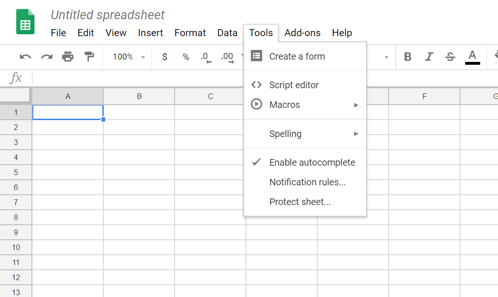
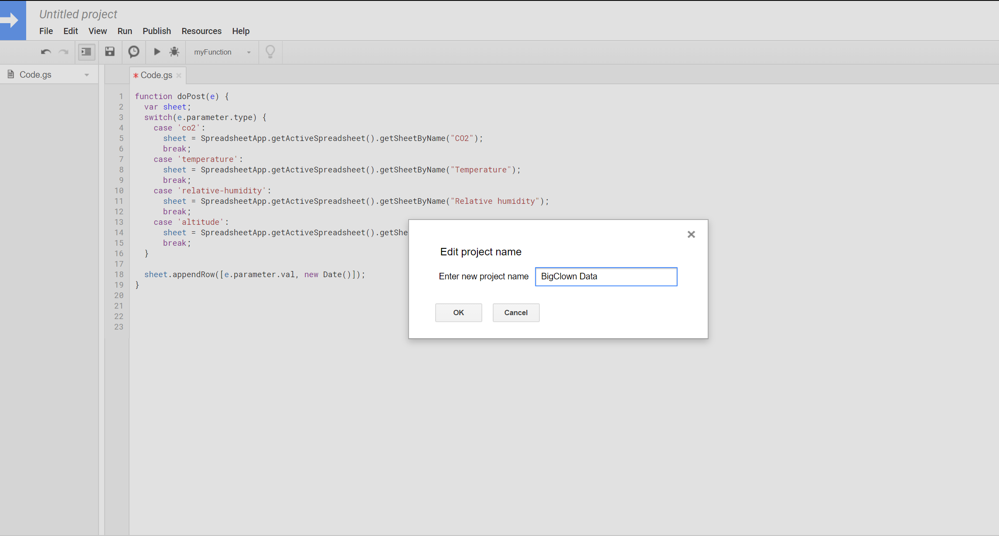
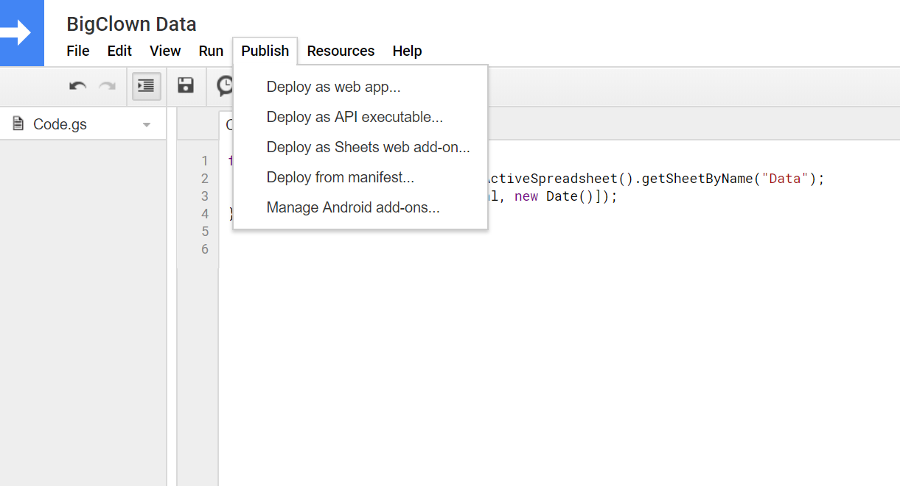
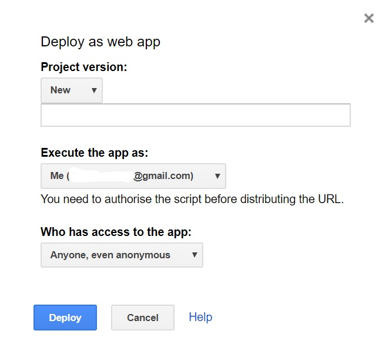
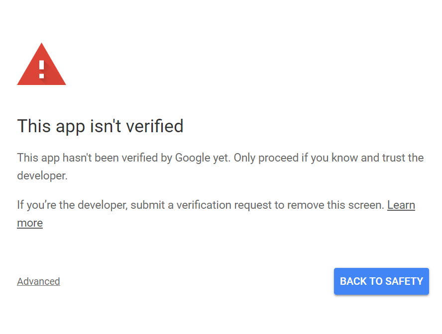
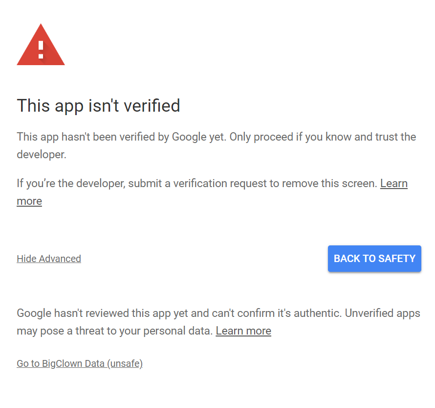
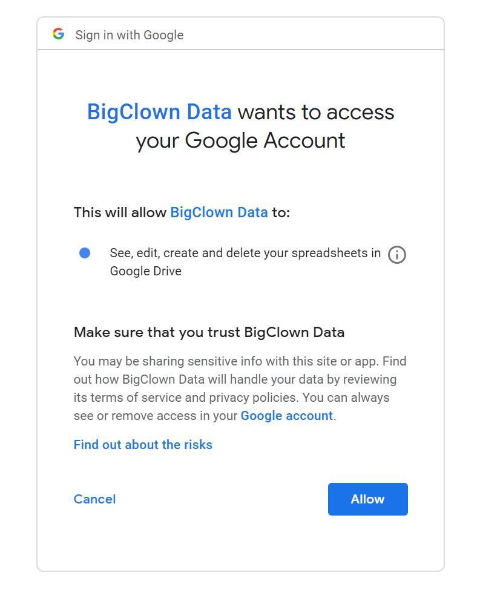
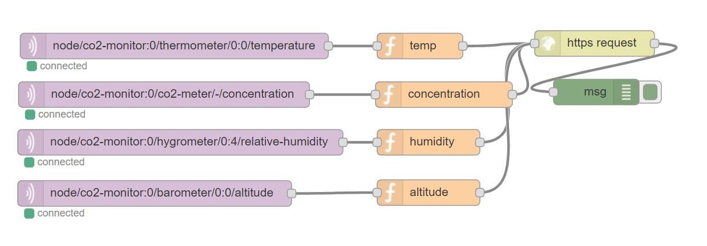
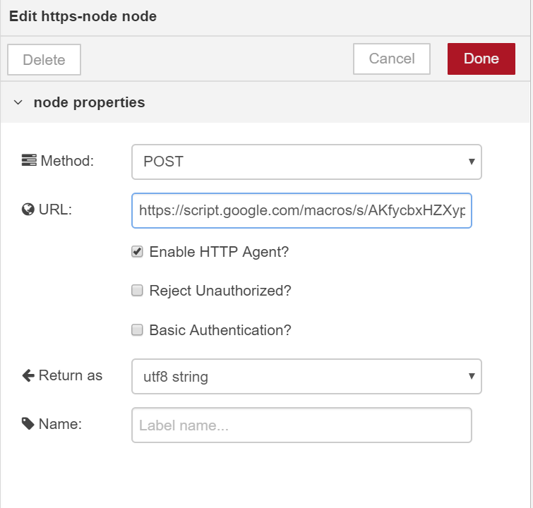

# Google Sheets

If you want to have your recorded values easily accessible online, Google Sheets may be a good solution. Let's find out how you can do that!


**Limits of Google Sheets**  
Google Sheets have limit of up to 5 milions cells, but that will take a while to fill up.


We will use the [CO2 Monitor Kit](https://www.bigclown.com/kits/co2-monitor/) as an example, but you can easily modify the code to any module, from which you want to save data.

## Google Sheets setup

### Step 1: Create a new Google Sheet \(You can use [sheets.new](https://www.bigclown.com/doc/integrations/google-sheets/sheets.new)\) or open an existing one

### Step 2: Sheets

Create separe sheet for each value you want to log. Match the name exactly, because we refer to it later in the code. Also, **set the A column format from Automatic to Number** in each sheet.


### Step 3: Open Script editor

Click on **Tools** and then on **Script editor**, this will open up a new tab, where you can write Google Apps Script code. 



### Step 4: Paste script

Paste following code inside the editor and press **Ctrl+S** to save.

```javascript
function doPost(e) {
var sheet;
switch(e.parameter.type) {
  case 'co2':
    sheet = SpreadsheetApp.getActiveSpreadsheet().getSheetByName("CO2");
    break;
  case 'temperature':
    sheet = SpreadsheetApp.getActiveSpreadsheet().getSheetByName("Temperature");
    break;
  case 'relative-humidity':
    sheet = SpreadsheetApp.getActiveSpreadsheet().getSheetByName("Relative humidity");
    break;
  case 'altitude':
    sheet = SpreadsheetApp.getActiveSpreadsheet().getSheetByName("Altitude");
    break;
}

sheet.appendRow([e.parameter.val, new Date()]);
}
```

### Step 5: Name the project and confirm



### Step 6: Press **Publish** and then **Deploy as web app**




### **Step 7: Set up a**uthorization

Dialog will pop up, change the **Who has access to the app** parameter to _Anyone, even anonymous_, to easily access the sheets from Node-RED.



### Step 8: Deploy

Press **Deploy** to confirm and now we need to authorise the script, press **Review Permissions**, then pick the account connected with the Sheets.


### Step 9: Press **Advanced**



### **Step 10:** Press **Go to \(Your project name\)**



### **Step 11:** Grant access to neccessary APIs with **Allow**



### **Step 12:** Finally, copy the URL


## Node-RED setup

### Step 1: Open **Node-RED** in your web browser



### Step 2: You can use either existing workspace or create new one

### Step 3: Install plugin

_node-red-contrib-https_ package \(using **Menu &gt;&gt; Manage pallete &gt;&gt; Install &gt;&gt; input node-red-contrib-https &gt;&gt; Install**\)

### Step 4: Create flow

Insert the following snippet in the flow \(using **Menu &gt;&gt; Import &gt;&gt; Clipboard**\) and click in Flow tab to paste the code

```text
[{"id":"bef58b5f.27f938","type":"mqtt in","z":"2c41a2bd.aa36ae","name":"","topic":"node/co2-monitor:0/co2-meter/-/concentration","qos":"2","broker":"29fba84a.b2af58","x":803,"y":147.00000381469727,"wires":[["5b4422c9.6962ac"]]},{"id":"d6e3e476.d463e8","type":"mqtt in","z":"2c41a2bd.aa36ae","name":"","topic":"node/co2-monitor:0/hygrometer/0:4/relative-humidity","qos":"2","broker":"29fba84a.b2af58","x":822,"y":203,"wires":[["33d8d2b1.afbcde"]]},{"id":"d7bd326c.165a1","type":"mqtt in","z":"2c41a2bd.aa36ae","name":"","topic":"node/co2-monitor:0/thermometer/0:0/temperature","qos":"2","broker":"29fba84a.b2af58","x":815,"y":90,"wires":[["5427a752.e5c088"]]},{"id":"28017643.d661ca","type":"https-node","z":"2c41a2bd.aa36ae","name":"","method":"POST","ret":"txt","url":"","authorized":false,"agent":true,"x":1306.0002403259277,"y":87.00000381469727,"wires":[["448243c5.0ff43c"]]},{"id":"448243c5.0ff43c","type":"debug","z":"2c41a2bd.aa36ae","name":"","active":true,"console":"false","complete":"true","x":1308.0000801086426,"y":144.00000095367432,"wires":[]},{"id":"5427a752.e5c088","type":"function","z":"2c41a2bd.aa36ae","name":"temp","func":"msg.payload = { val: msg.payload,\n                type: 'temperature'};\n msg.headers = {'content-type':'application/x-www-form-urlencoded'};\nreturn msg;","outputs":1,"noerr":0,"x":1102.000072479248,"y":90,"wires":[["28017643.d661ca"]]},{"id":"5b4422c9.6962ac","type":"function","z":"2c41a2bd.aa36ae","name":"concentration","func":"msg.payload = { val: msg.payload,\n                type: 'co2'};\n msg.headers = {'content-type':'application/x-www-form-urlencoded'};\nreturn msg;","outputs":1,"noerr":0,"x":1130.0002365112305,"y":147.00000286102295,"wires":[["28017643.d661ca"]]},{"id":"33d8d2b1.afbcde","type":"function","z":"2c41a2bd.aa36ae","name":"humidity","func":"msg.payload = { val: msg.payload,\n                type: 'relative-humidity'};\n msg.headers = {'content-type':'application/x-www-form-urlencoded'};\nreturn msg;","outputs":1,"noerr":0,"x":1112,"y":203,"wires":[["28017643.d661ca"]]},{"id":"3723fcb7.105f94","type":"mqtt in","z":"2c41a2bd.aa36ae","name":"","topic":"node/co2-monitor:0/barometer/0:0/altitude","qos":"2","broker":"29fba84a.b2af58","x":792,"y":263.00000762939453,"wires":[["224e0d6f.369da2"]]},{"id":"224e0d6f.369da2","type":"function","z":"2c41a2bd.aa36ae","name":"altitude","func":"msg.payload = { val: msg.payload,\n                type: 'altitude'};\n msg.headers = {'content-type':'application/x-www-form-urlencoded'};\nreturn msg;","outputs":1,"noerr":0,"x":1112.000072479248,"y":262.00000762939453,"wires":[["28017643.d661ca"]]},{"id":"29fba84a.b2af58","type":"mqtt-broker","z":"","broker":"localhost","port":"1883","clientid":"","usetls":false,"compatmode":true,"keepalive":"60","cleansession":true,"willTopic":"","willQos":"0","willPayload":"","birthTopic":"","birthQos":"0","birthPayload":""}]
```

It will look like this:




This snippet sends data to Google Sheets


### Step 5: Create https request

Open the **https request** node. In the _URL field_ paste your URL, append following snippet and press Done.

```text
?value={{{payload}}}
```

Your URL now should look like this:

```text
https://script.google.com/macros/s/AKfycbxHZXypk24YVRKZMzJkau46fd6PF7ytmaiYSlTN1DT/exec?value={{{payload}}}
```



### Step 6: Deploy the flow using the **Deploy** button in the top-right corner.

### Step: Finishing

Your data should now start appearing in the Sheets, feel free to style the Sheets to you liking, add graphs and more.



**Google Apps Script**  
Google Apps Script allows you to extend Google apps and it is nearly similiar to JavaScript, so it's easy to use.



