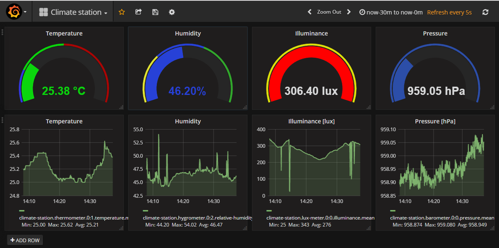
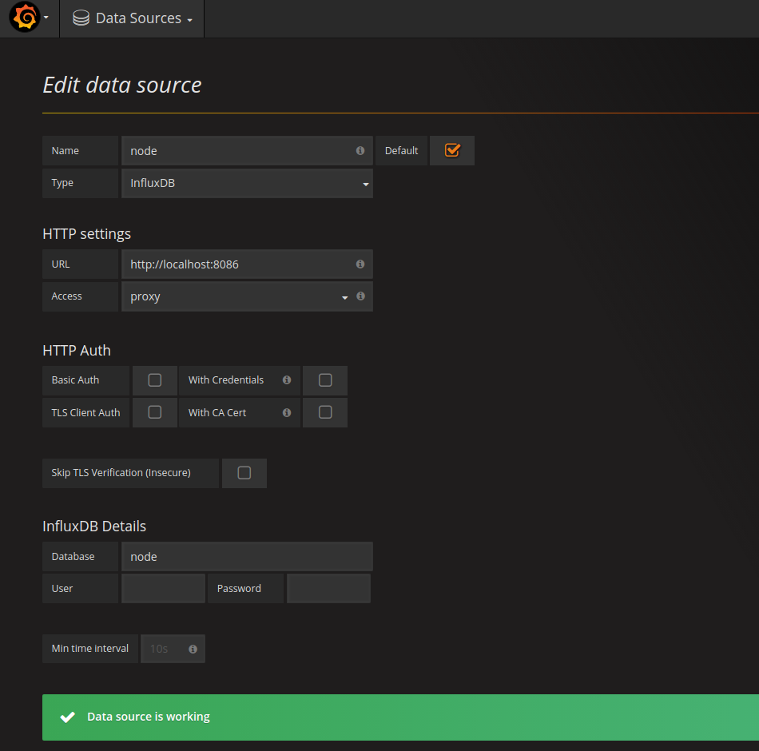
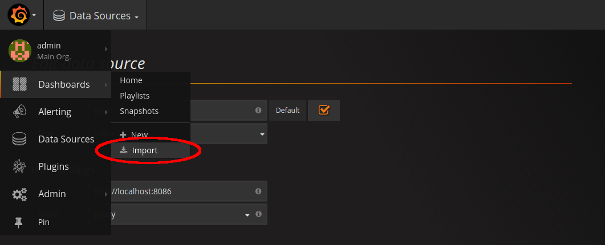
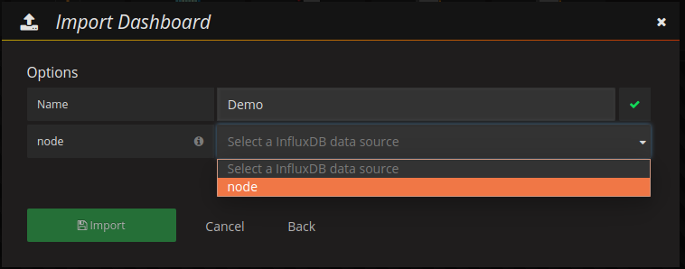
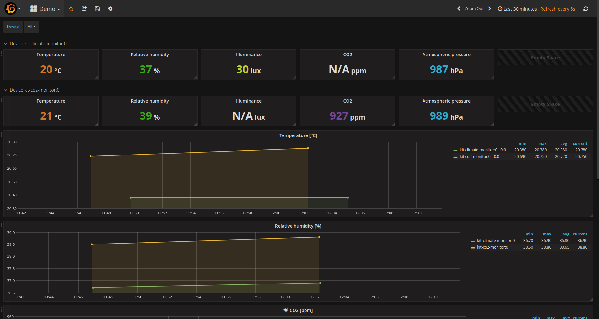

# Grafana for Visualization

[**Grafana**](https://grafana.com/) is an open platform for beautiful analytics and monitoring. It allows you to create a nice looking dashboards that will give you quick insights into your sensor data.



## Requirements

You will need these components to make it work:

* **Debian-based Linux**, or **macOS**
* **Mosquitto** - MQTT broker



This setup has been tested on:

* **Raspberry Pi 3** + **Raspbian Jessie**
* **Turris Omnia** + **Ubuntu 16.04** \(via LXC container\)
* **macOS 10.13**

## Installing InfluxDB on Linux

### Step 1: Install dependency packages

```text
sudo apt install apt-transport-https curl -y
```

### Step 2: Add repository key

```text
curl -sL https://repos.influxdata.com/influxdb.key | sudo apt-key add -
```

### Step 3: Add repository to source list



```text
echo "deb https://repos.influxdata.com/debian stretch stable" | sudo tee /etc/apt/sources.list.d/influxdb.list
```



```text
echo "deb https://repos.influxdata.com/ubuntu/ xenial stable" | sudo tee /etc/apt/sources.list.d/influxdb.list
```



### Step 4: Update the package list and install the packages

```text
sudo apt update && sudo apt install influxdb
```

### Step 5: Now you can start the **InfluxDB** service

```text
sudo systemctl start influxdb
```

## Installing Grafana on Linux

### Step 1: Install dependencies

```text
sudo apt install adduser libfontconfig -y
```

### Step 2: Based on your taget platform, select the appropriate procedure



#### Step 1: You can manualy download latest version from [**Grafana**](https://github.com/fg2it/grafana-on-raspberry/releases/latest), or you can use the following helper to download it for you

```text
wget $(wget "https://api.github.com/repos/fg2it/grafana-on-raspberry/releases/latest" -q -O - | grep browser_download_url | grep armhf.deb | head -n 1 | cut -d '"' -f 4) -O grafana.deb
```

#### Step 2: Then install the package

```text
sudo dpkg -i grafana.deb
```



#### Step 1: Add repository key

```text
curl -sL https://packages.grafana.com/gpg.key | sudo apt-key add -
```

#### Step 2: Add repository to source list

```text
echo "deb https://packages.grafana.com/oss/deb stable main" | sudo tee /etc/apt/sources.list.d/grafana.list
```

#### Step 3: Then update the package list and install the package

```text
sudo apt update && sudo apt install grafana -y
```



### Step 3: Reload the **systemd** configuration

```text
sudo systemctl daemon-reload
```

### Step 4: Enable **Grafana** on boot

```text
sudo systemctl enable grafana-server
```

### Step 5: Now you can start the **Grafana** server

```text
sudo systemctl start grafana-server
```

Continue in the section [**Connect Mosquitto and InfluxDB**](grafana-for-visualization.md#connect-mosquitto-and-influxdb).

## Installing InfluxDB on macOS

### Step 1: Open the **Terminal** application.

### Step 2: Make sure you have [**Homebrew**](https://brew.sh/) installed.

### Step 3: Install **InfluxDB**

```text
brew install influxdb
```

### Step 4: Enable **InfluxDB** service

```text
brew services start influxdb
```

## Installing Grafana on macOS

### Step 1: Open the **Terminal** application

### Step 2: Make sure you have [**Homebrew**](https://brew.sh/) installed

### Step 3: Install Grafana

```text
brew install grafana
```

### Step 4: Enable **Grafana** service

```text
brew services start grafana
```

## Connect Mosquitto and InfluxDB

### Step 1: Install the **MQTT to InfluxDB** service

```text
sudo pip3 install --upgrade mqtt2influxdb
```

### Step 2: Create the `/etc/bigclown` directory

```text
sudo mkdir /etc/bigclown
```

### Step 3: Open the configuration file


For text editing, we use **nano** editor. You can save changes by pressing key combination `Ctrl + O` and exit editor by pressing `Ctrl + X`.


```text
sudo nano /etc/bigclown/mqtt2influxdb.yml
```

### Step 4: Paste this snippet to the configuration file



```yaml
mqtt:
  host: 127.0.0.1
  port: 1883

influxdb:
  host: 127.0.0.1
  port: 8086
  database: node

points:
  - measurement: temperature
    topic: node/+/thermometer/+/temperature
    fields:
      value: $.payload
    tags:
      id: $.topic[1]
      channel: $.topic[3]

  - measurement: relative-humidity
    topic: node/+/hygrometer/0:4/relative-humidity
    fields:
      value: $.payload
    tags:
      id: $.topic[1]

  - measurement: illuminance
    topic: node/+/lux-meter/0:0/illuminance
    fields:
      value: $.payload
    tags:
      id: $.topic[1]

  - measurement: pressure
    topic: node/+/barometer/0:0/pressure
    fields:
      value: $.payload
    tags:
      id: $.topic[1]

  - measurement: co2
    topic: node/+/co2-meter/-/concentration
    fields:
      value: $.payload
    tags:
      id: $.topic[1]

  - measurement: voltage
    topic: node/+/battery/+/voltage
    fields:
      value: $.payload
    tags:
      id: $.topic[1]

  - measurement: button
    topic: node/+/push-button/+/event-count
    fields:
      value: $.payload
    tags:
      id: $.topic[1]
      channel: $.topic[3]
```




In the section **tags** you can your identifiers, e.g.: `tags: room: bedroom`


### Step 5: Configuration file test

```text
mqtt2influxdb -c /etc/bigclown/mqtt2influxdb.yml --test
```

### Step 6: Start the **MQTT to InfluxDB** service

```text
pm2 start `which python3` --name "mqtt2influxdb" -- `which mqtt2influxdb` -c /etc/bigclown/mqtt2influxdb.yml
```

### Step 7: Save the **PM2 state** \(so it will start after reboot\)

```text
pm2 save
```


If you want to see temperature records from database in CSV format, use this command:

`influx -database node -execute "select * from temperature;" -format csv`

Then you must restart the service when you change the configuration file

`pm2 restart mqtt2influxdb`


## Configure Grafana

### Step 1: Open the Grafana web interface at [**http://localhost:3000/**](http://localhost:3000/) or [**http://hub.local:3000/**](http://hub.local:3000/) or [_http://ip:3000/_](http://ip:3000/) and log in

* Enter the **User** `admin`
* Enter the **Password** `admin`

### Step 2: Create a **data source**

Select **Add data source** and then:

* Enter the **Name:** `node`
* Select the **Type:** `InfluxDB`
* Enter the **URL:** `http://localhost:8086`
* Enter the **Database:** `node`

Finish by clicking on the **Add** button. At this moment **Grafana** will try to connect to the **data source** and replies back with the message **Data source is working**.



### **Step 3:** Download `dashboard.json` or copy the content of this file to clipboard



### Step 4: Import the visualization dashboards, click the **Grafana icon** \(top left button\), select **Dashboards** in the menu, then choose **Import**



### **Step 5:** Upload the `dashboard.json` file or paste the JSON from clipboard

### Step 6: Choose **node** as a data source and click on **Import**



### **Step 7:** Result for [**Wireless Climate Monitor**](https://www.bigclown.com/doc/projects/radio-climate-monitor/) and [**Wireless CO2 Monitor**](https://www.bigclown.com/doc/projects/radio-co2-monitor/)



## Related Documents

* [**Raspberry Pi Installation**](../tutorials/raspberry-pi-installation.md)
* [**MQTT Protocol**](../interfaces/mqtt-protocol.md)

