# HomeKit and Siri

With HomeKit integration you will be able to controll your IoT projects from your iOS or macOS device. After you have your device in your Home app, you can control it using Siri. In the end of arcticle you will ask Siri on temperature in your bedroom and she will tell you back temperature from your BigClown temperature sensor!

## Instalation

If you want to use following integration on [BigClown Hub](https://shop.bigclown.com/bigclown-hub/) or on Debian and Ubuntu system, you have to install few dependencies. Connect to command line of BigClown Hub, use arcticle [Rasperry Pi Login](../tutorials/raspberry-pi-login.md). After you login in, copy, paste and run commands. If you need IP adress of BigCwlown Hub, use [BigClown Playground](https://github.com/bigclownlabs/bch-playground/releases/) that will show you IP of your BigClown Hub in your network:

```text
sudo apt-get update
```

```text
sudo apt-get install libavahi-compat-libdnssd-dev
```

Open BigClown Hub in your Browser \(Linux and macOS can use [hub.local](http://hub.local/), on Windows you have to use IP adress of BigClown Hub\). In menu select functions and on top right corner click on hamburger menu. Click on manage pallete and select Install card, where search:

```text
node-red-contrib-homekit-bridged
```

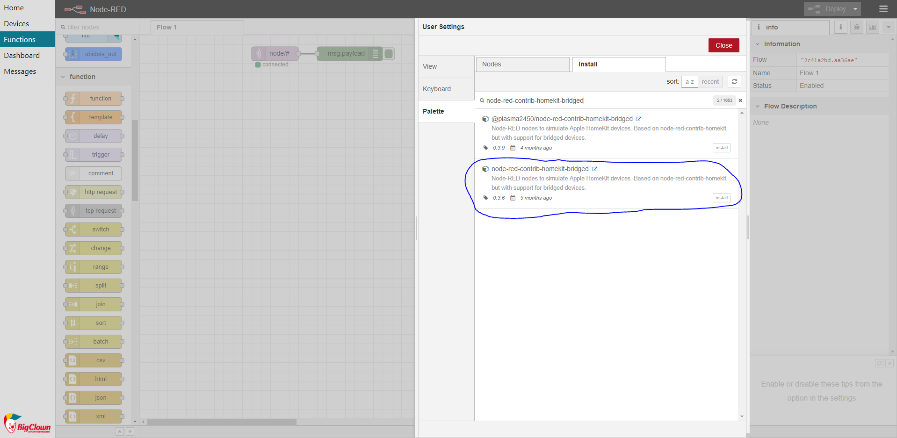

When message with title **Installing 'node-red-contrib-homekit-bridged'** will popup, just click Install. After Installation you have to see module in advacted group.

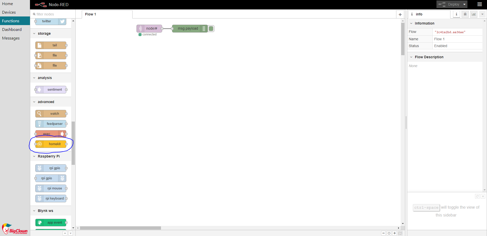

## Connect hardware

### Step 1: Flash firmware

We have installed HomeKit plugin to Node-RED. Now open [BigClown Playground](https://github.com/bigclownlabs/bch-playground/releases/) on your Computer. Prepair microUSB cable, [Core Module](https://shop.bigclown.com/core-module/) and battery module \([standart](https://shop.bigclown.com/battery-module/) or [mini](https://shop.bigclown.com/mini-battery-module/)\). Connect Core Module to computer via microUSB cable and open BigClown Playground. Click on Firmware option in menu, use bigclownlabs/bcf-radio-push-button and Click Flash. 

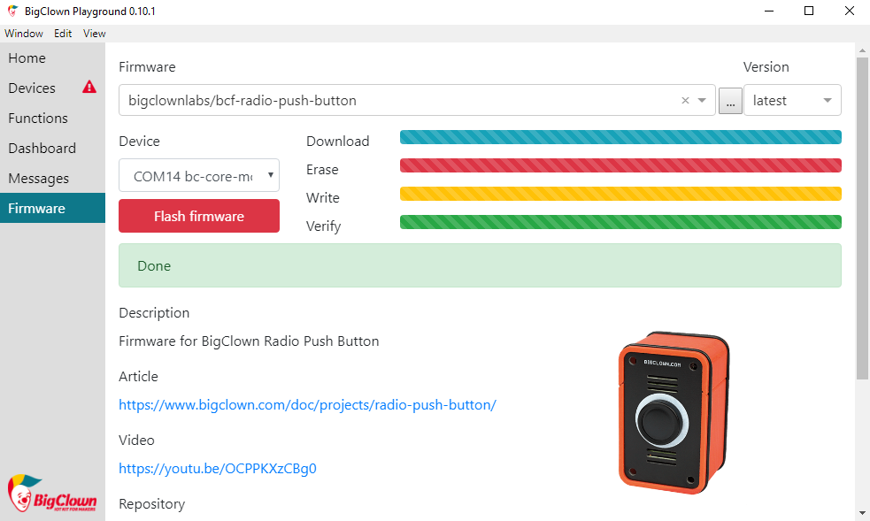

### Step 2: Pair Hardware

Open BigClown Hub page in browser same as in chapter Instalation and select Device option in menu and click on Start pairing button.

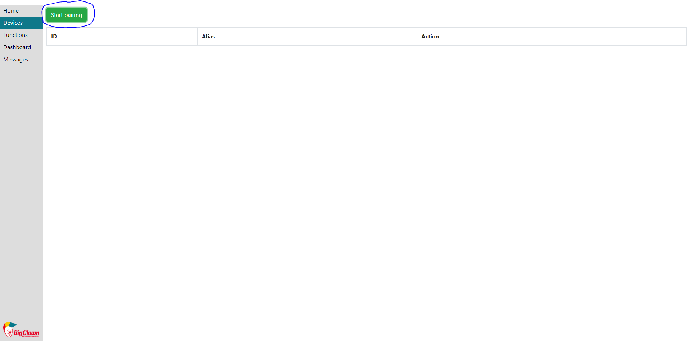

### Step 3: **Assembly Hardware**

Now unplug Core Module from microUSB cable and connect it to battery module \(standart or mini\)**.**

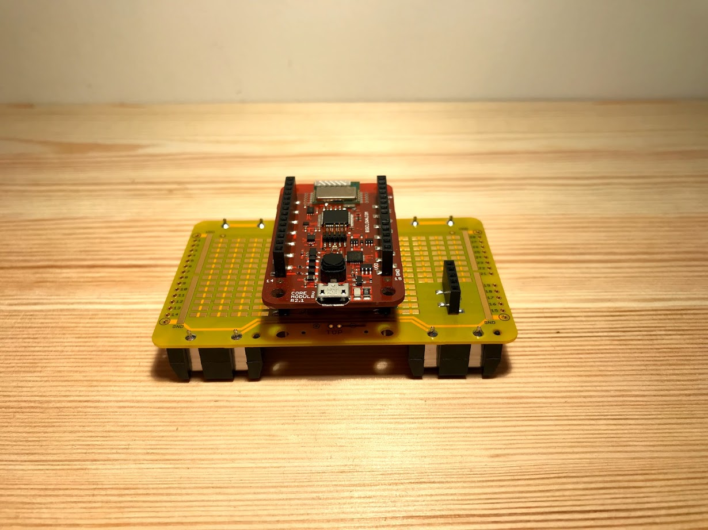

### **Step 4: Ending**

You have to see connected device now, do not forget to Click **Stop Pairing**. You can look at Messages option and see that temperature is incomming now.

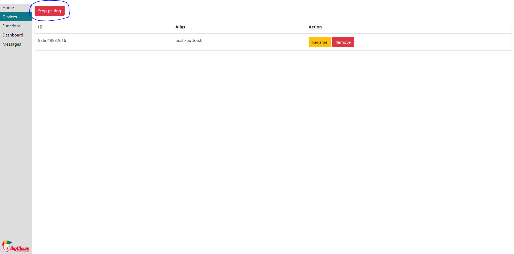

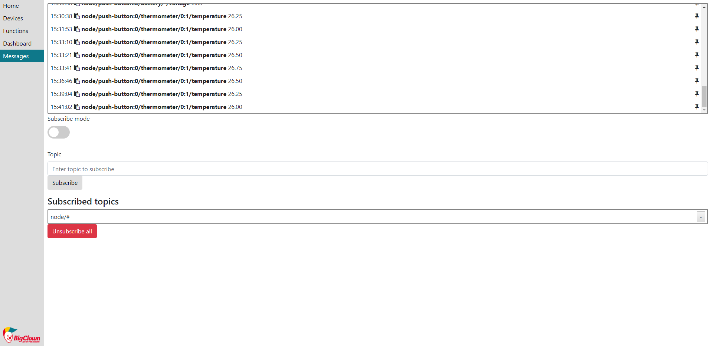

## Make it functionally

### **Step 1:** Open Function option in menu. Open Hamburger menu, select Import &gt; Clipboard and paste following code

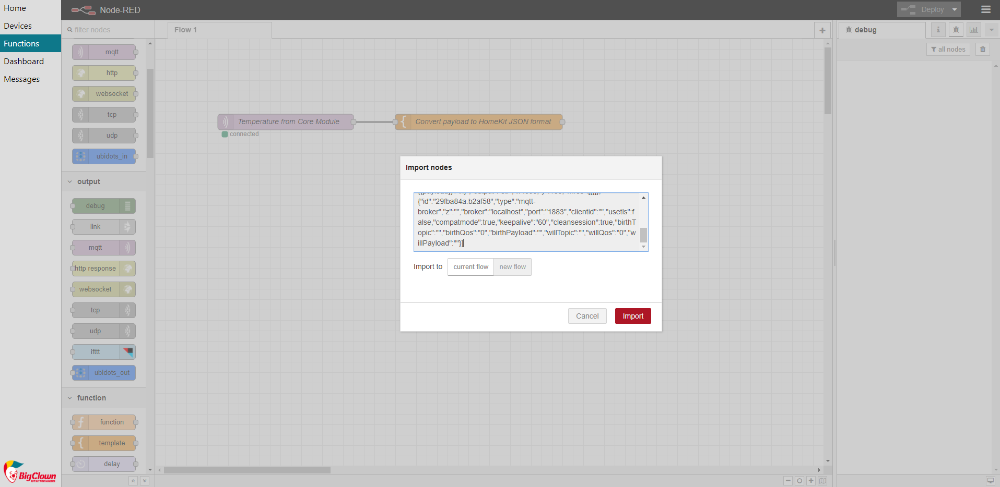

```text
[{"id":"c10a49.8c0905b8","type":"mqtt in","z":"2c41a2bd.aa36ae","name":"Temperature from Core Module","topic":"node/push-button:0/thermometer/0:1/temperature","qos":"2","broker":"29fba84a.b2af58","x":230,"y":180,"wires":[["d7033322.3f2d5"]]},{"id":"d7033322.3f2d5","type":"template","z":"2c41a2bd.aa36ae","name":"Convert payload to HomeKit JSON format","field":"payload","fieldType":"msg","format":"handlebars","syntax":"mustache","template":"{\n\"CurrentTemperature\": \"{{payload}}\"\n}","output":"str","x":600,"y":180,"wires":[[]]},{"id":"29fba84a.b2af58","type":"mqtt-broker","z":"","broker":"127.0.0.1","port":"1883","clientid":"","usetls":false,"compatmode":true,"keepalive":"60","cleansession":true,"birthTopic":"","birthQos":"0","birthPayload":"","willTopic":"","willQos":"0","willPayload":""}]
```

So flow should looks like following:

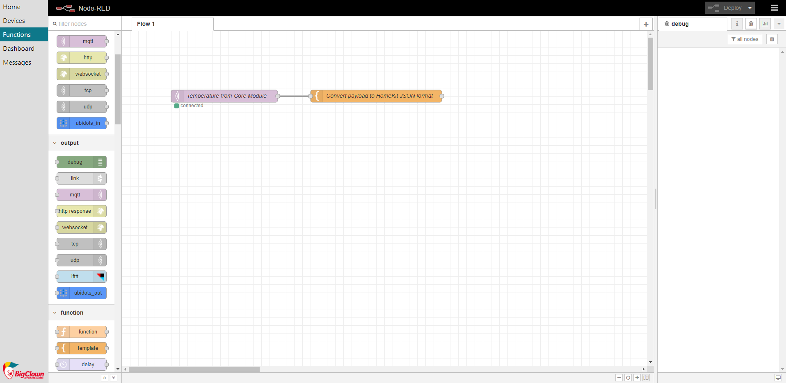

### Step 2: Place Homekit node from advanced group and connect it to template node in flow

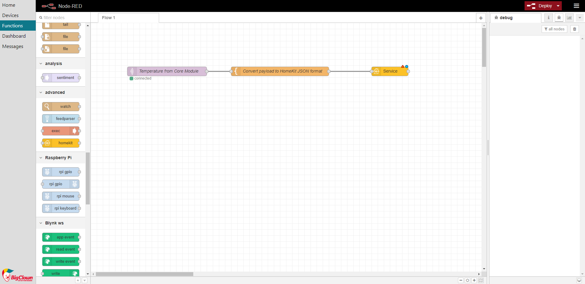

### Step 3: Double-click on HomeKit node in flow, settings should popup

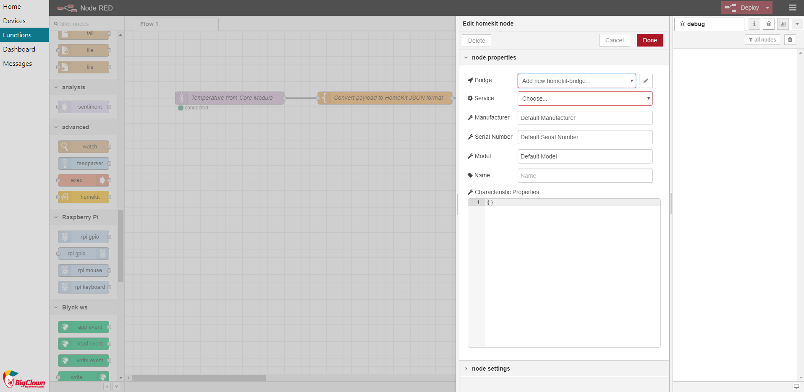

### Step 4: Setup bridge

Let's setup bridge. Bridge is basically, bridge, between our Hardware sensors and your iPhones, iPads, Macs, etc... So Click on little pencil icon next to the bridge chapter of setting and fill it as following and click Add:

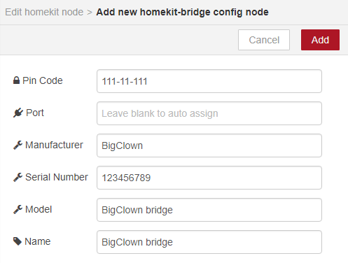

### Step 5: Rest of the setting fill same as on screenshow bellow. Click Done and Deploy

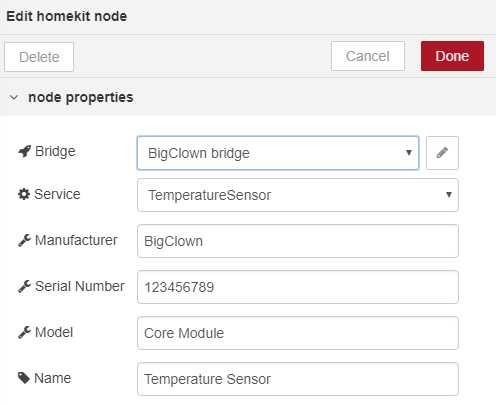

### Step 6: Pairing

Now as you can see on your screen and screenshot bellow. Device is waiting for pairing with code 111-11-111. So open Home app on your iPhone or iPad and click Add Accessory &gt; Don't Have a Code or Can't Scan &gt; BigClown bridge. Add anyway on next screen. In screen where you have to input code, input just 1 to all boxes:

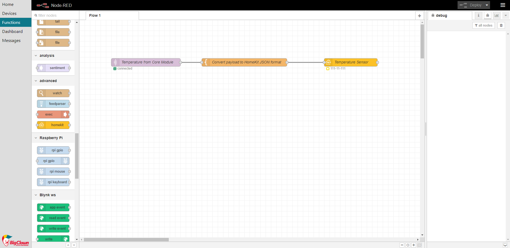

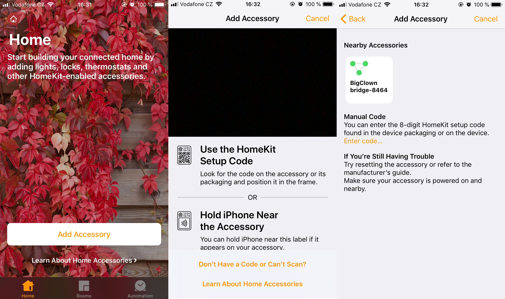

### Step 7: Setup

Now just setup where is your bridge and temperature sensore and your sensor is added!

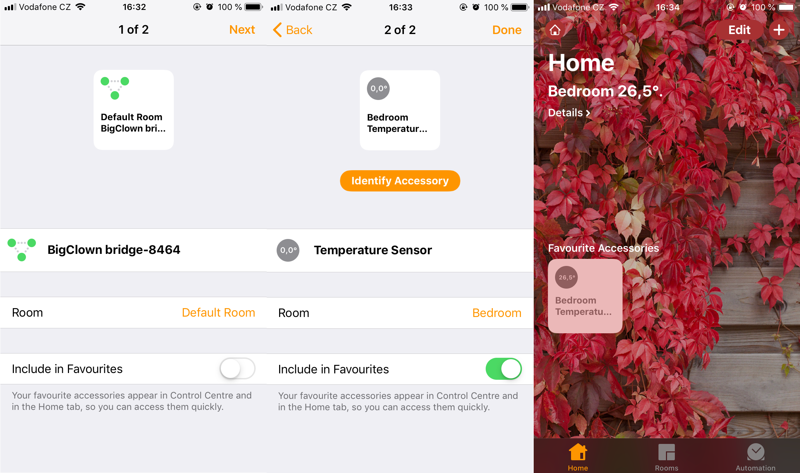

## Siri

If you have some device in Home app, you can control it or get infromation via Siri. So if you want to get temperature from Core Module which we just set up, just ask Siri "what's the temperature in bedroom?" \(or what room you selected\).

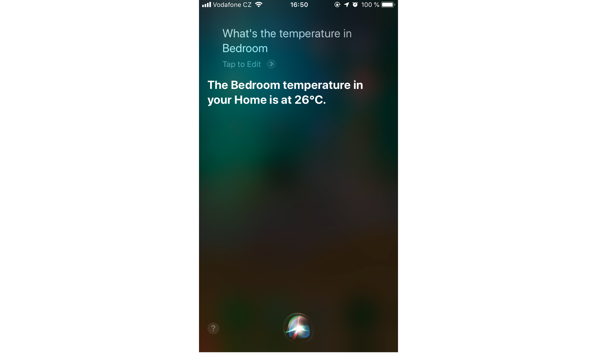

## Conclusion

With HomeKit plugin you are able to simulate real HomeKit devices. This plugin can also control things. So you can use it to control [Relay Module](https://shop.bigclown.com/relay-module/), etc... This plugin have little issue. Every time, you Deploy flow, you have to reset all Node-RED, or the HomeKit plugin won't work. You can do it by following command \(you have to do it on BigClown hub if the plugin is installed there\):

```text
pm2 restart node-red
```

