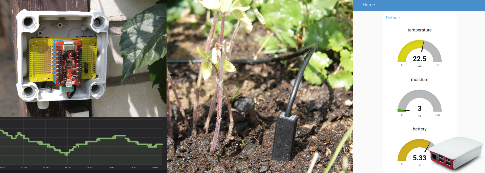
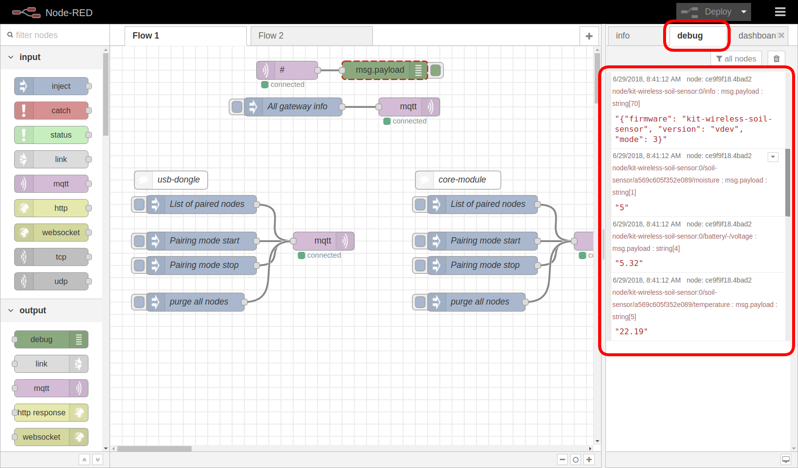
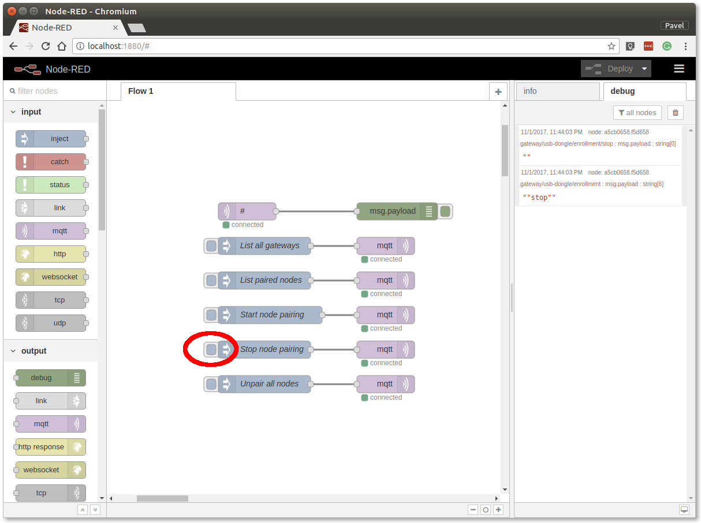
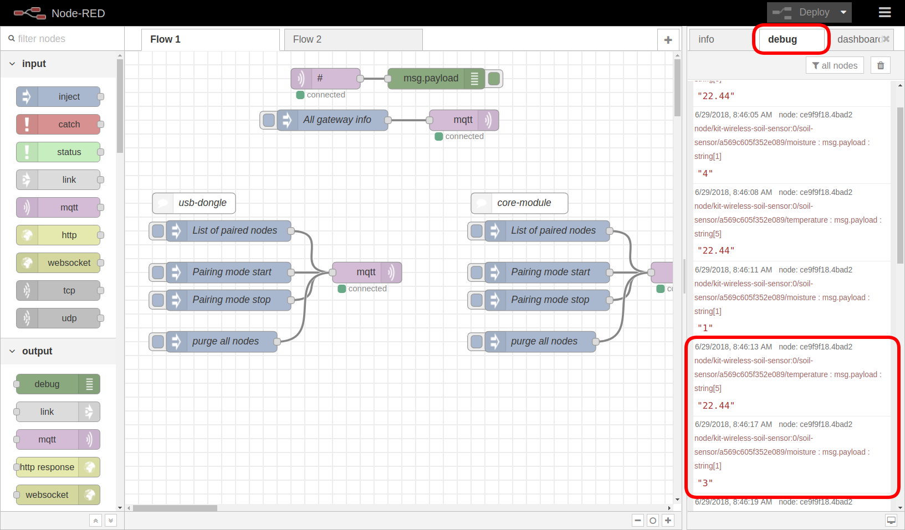
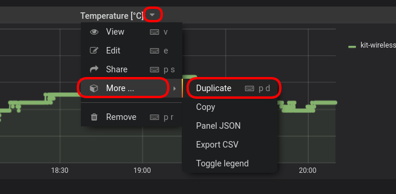
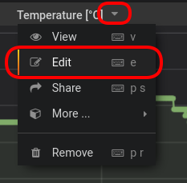
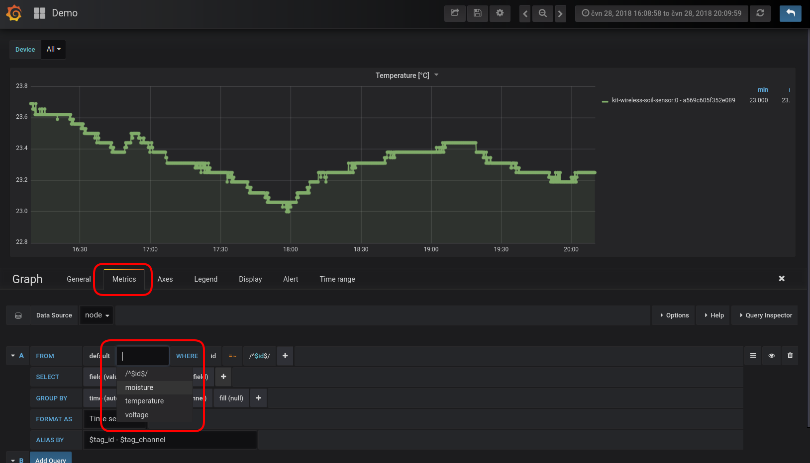

# Radio Soil Sensor

This document will guide you through the **Radio Soil Sensor** project. You will be able to see, save and analyze moisture level and temperature in **Node-RED** and **Grafana** visualization tool.



## Video tutorial



## Block Concept


## Requirements

* Either **BigClown Radio Soil Sensor Kit**, or individual components:
  * 1x **BigClown** [**Soil Moisture Sensor**](https://shop.bigclown.com/soil-moisture-sensor)
  * 1x **BigClown** [**Sensor Module**](https://shop.bigclown.com/sensor-module)
  * 1x **BigClown** [**Core Module**](https://shop.bigclown.com/core-module)
  * 1x **BigClown** [**Battery Module**](https://shop.bigclown.com/battery-module)
  * 1x **BigClown** [**Radio Dongle**](https://shop.bigclown.com/radio-dongle)
* You will need **Raspberry Pi** with the **BigClown Raspbian** distribution installed. Please see [**Raspberry Pi Installation**](../tutorials/raspberry-pi-installation.md) document.

Measured data will be saved and visualized in Grafana on [**Raspberry Pi**](https://shop.bigclown.com/raspberry-pi-3-set). It is also possible to use your computer. Just follow [**Quick Start Guide**](../basics/quick-start-guide.md) document.

## Connecting to Raspberry Pi

All the configuration, services and flashing firmware will be done on the **Raspberry Pi**. You use your computer only to connect to the **Raspberry Pi SSH** server and **Grafana** web page.

Please follow the [**Raspberry Pi Login**](../tutorials/raspberry-pi-login.md) document where you find how to discover **Raspberry Pi IP address** on your network and connect to the **SSH server**.

## Firmware Upload

In this procedure we will use the **BigClown Firmware Tool** to upload firmware to the **Core Module**. You will connect and flash firmware with **Raspberry Pi**

Now it's time to write firmware to the **Core Module**.

### Step 1: Connect the Micro USB cable to the **Core Module** and **Raspberry Pi**

### **Step 2:** Upload the firmware to the **Core Module**:


You may want to update available firmwares by `bcf update` if the installation has been prolonged for a longer time after Playground Setup



**Flashing Core Module R1 & R2**  
For differences of flashing older **Core Module 1** and newer **Core Module 2** please read **Core Module R1 and R2 comparison** in the **Hardware section**


Run the BigClown Playground. In the Firmware tab choose and upload the `bcf-radio-soil-sensor` firmware to the **Core Module**:

### Step 3: Remove the Micro USB cable from the **Core Module** and **Raspberry Pi**


At this point your firmware is successfully uploaded


## Hardware Assembling

### **Step 1:** Start with the [**Battery Module**](https://shop.bigclown.com/battery-module)


Make sure the **Battery Module** does not have batteries inserted.


### **Step 2:** Plug the [**Core Module**](https://shop.bigclown.com/core-module) on top of the [**Battery Module**](https://shop.bigclown.com/battery-module).

### Step 3: Plug the [**Sensor Module**](https://shop.bigclown.com/sensor-module) on top of the [**Core Module**](https://shop.bigclown.com/core-module).

### Step 4: Plug the [**Soil Moisture Sensor**](https://shop.bigclown.com/soil-moisture-sensor) connector to the [**Sensor Module**](https://shop.bigclown.com/sensor-module).

## Radio Pairing

In this section, we will create a radio link between the **Radio Dongle** and the **Radio Climate Monitor**.

Follow these steps in **Node-RED**:

### Step 1: Click on the **Start node pairing** button


Make sure, that after pressing the **Start node pairing** button in the right **debug** tab you have two messages. One is command and the second one with **""start""** is the response from **Radio Dongle**.



### Step 2: Assembly

Insert the batteries into the **Radio Climate Monitor** to send the pairing request \(you should also see the red LED on the **Core Module** to be on for about 2 seconds\).

In the **Node-RED** debug tab, there is a message about name and firmware version of the new paired module.



### Step 3: Click on the **Stop node pairing** button




At this point, you've got established a radio link between the node \(**Radio Moisture Sensor**\) and the gateway \(**Radio Dongle**\).


## Communication Test

Follow these steps in **Node-RED**:

### Step 1: Switch to **debug** tab on the right

### Step 2: Test it:

Start breathing on the temperature sensor on the **Soil Sensor** to invoke a change of temperature and hence trigger a radio transmission.

You should then see similar messages:




At this point, you've got verified radio communication.


## Enclosure

Optionally put the assembly into the appropriate enclosure, if you have one.


You can find more information about the enclosures in the document [**Enclosures**](../basics/enclosures.md).


## Integration Grafana

Now we have assembled our kit and let's start with some basic integration with **Grafana**.

### Step 1: Install dependencies

Install **Grafana** and **InfluxDB** database to your **Raspberry Pi**. This is explained in [**Grafana for Visualization** ](../integrations/grafana-for-visualization.md)document

### Step 2: Edit config

Add these lines to the /etc/bigclown/mqtt2influxdb.yml configuration file which you had created in the **Grafana for Visualization** tutorial. This adds support for new topics that Soil Sensor sends.


For text editing, we use **nano** editor. You can save changes by pressing key combination `Ctrl + O` and exit editor by pressing `Ctrl + X`.


Open mqtt2influxdb configuration in **nano** text editor.

```text
sudo nano /etc/bigclown/mqtt2influxdb.yml
```

And append these lines at the end of the existing file:


```text
- measurement: moisture
    topic: node/+/soil-sensor/+/moisture
    fields:
        value: $.payload
    tags:
        id: $.topic[1]
        channel: $.topic[3]

- measurement: temperature
    topic: node/+/soil-sensor/+/temperature
    fields:
        value: $.payload
    tags:
        id: $.topic[1]
        channel: $.topic[3]
```


### Step 1: Test that the configuration is valid. Otherwise there is some formating error in the YAML file

```text
mqtt2influxdb -c /etc/bigclown/mqtt2influxdb.yml --test
```

### Step 2: Restart MQTT2InfluxDB service, because we've changed the configuration

```text
pm2 restart mqtt2influxdb
```

### Step 3: Open **Grafana** page which is running on **Raspberry Pi** on port `3000`

[http://hub.local:3000](http://hub.local:3000)

### Step 4: Graph

Now you can see temperature and battery voltage on the bottom. We need to add a moisture graph. Because we added `- measurement: moisture` to the config file, we need to duplicate existing graph and change its `measurement` data source to `moisture`.



Now click on **Edit** in the **duplicated** graph.



Now in **Metrics** tab change the **FROM** item from value **temperature** to **moisture**.



### Step 5: Save

Now click on the **Save** button in the **Grafana** so all your configuration stays the same next time you open the page.


### Related Documents <a id="related-documents"></a>

* [**Raspberry Pi Installation**](../tutorials/raspberry-pi-installation.md)
* [**Raspberry Pi Login**](../tutorials/raspberry-pi-login.md)

