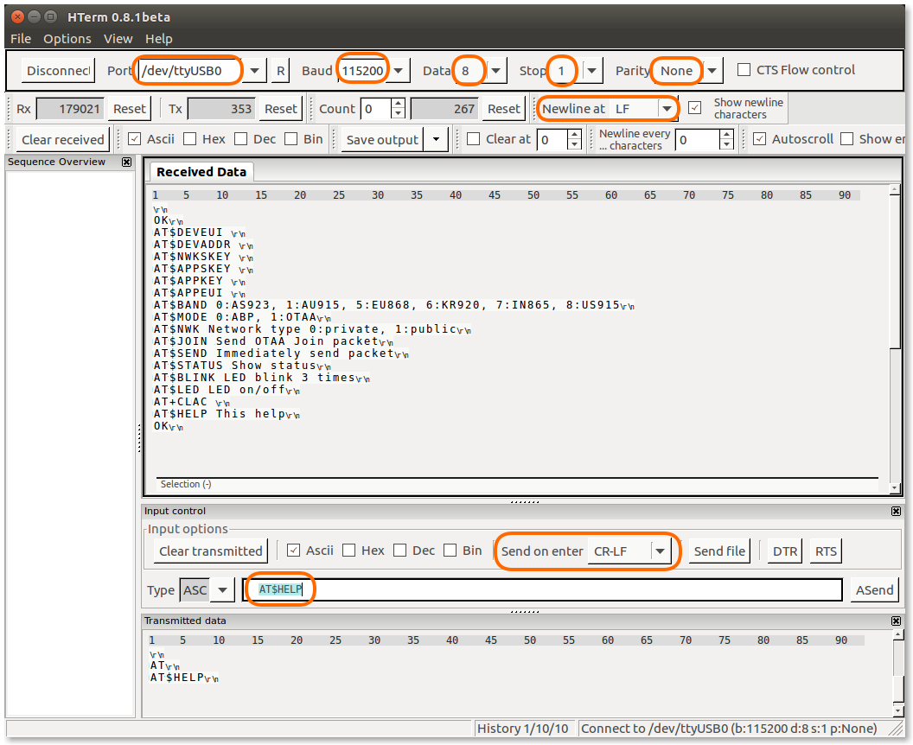

# LoRa AT Commands Configuration

This document describes how to configure BigClown LoRa devices over USB virtual serial port and AT commands. This document does not explain project-specific firmware commands and functions. They are explained in the project itself.


This guide applies to all firmwares in the BigClown Playground which has prefix `bcf-lora`


## LoRa Configuration

For configuration you can use `AT` commands over USB virutal serial port. Use your serial terminal application \([Hterm](http://www.der-hammer.info/terminal/), putty, minicom\).

* Baudrate 115200
* 8 data bits, 1 stop bit, no parity
* New line `CR+LF` for transmit and for receive

## HTerm

You can downlaod [Hterm](http://www.der-hammer.info/terminal/) for Windows and Linux. It also supports macros and sequences in the left panel for most used commands. Type the command and press **ENTER**. Not the ASend button.



## Picocom

if you use picocom, open terminal with the command

```text
picocom -b 115200 --omap crcrlf --echo /dev/ttyUSB0
```

You exit from picocom by `CTRL+A` then `CTRL+Q`.

## Putty

Putty is tricky to set, because the "Implicit LF every CR" configuration works only for receiving data. Every time before pressing enter you have to press `CTRL+J` to also send `LF`character.

## AT Commands

To list all possible commands use `AT$HELP`. You will get:

```text
AT$DEVEUI
AT$DEVADDR
AT$NWKSKEY
AT$APPSKEY
AT$APPKEY
AT$APPEUI
AT$BAND 0:AS923, 1:AU915, 5:EU868, 6:KR920, 7:IN865, 8:US915
AT$MODE 0:ABP, 1:OTAA
AT$JOIN Send OTAA Join packet
AT$SEND Immediately send packet
AT$STATUS Show status
AT$BLINK LED blink 3 times
AT$LED LED on/off
AT+CLAC
AT$HELP This help
```

To read the parameter use:

```text
AT$APPSKEY?
```

You receive the key:

```text
$APPSKEY: BF22C15EB89237A65DAABB05B2C91EB4
```

To write the parameter:

```text
AT$APPSKEY=BF22C15EB89237A65DAABB05B2C91EB4
```

## OTAA - Over-the-Air Activation

OTAA means that the session keys \(the ones with **S** in the name\) are generated on the server and transfered to your LoRa Module automatically after the **JOIN** command. If your backend does not support OTAA, follow the **ABP** chapter below. If you're not sure which activation type to use, start with `OTAA`.

For the LoRa backend you need to read `DEVEUI` from LoRa Module

```text
$DEVEUI: 009335FF931FEADC
```

```text
OK
```


Some backends also allow you to read `APPKEY` from the modem, but it is not necessary because it is generated for you. Some backends also supports generating `DEVEUI` but we do not recommend rewriting this number.


Backend \(for example TTN\) will give you these information you write to the modem: `APPEUI`, `APPKEY`.

Example configuration of received keys:

```text
AT$APPEUI=324502A5676BADD7
OK
AT$APPKEY=44D4A5DA7A9507F036C5A2750211F052
OK
```

Everytime you get `OK` the keys are saved inside the LoRa Module's internal Flash memory.

After this you have to switch modem to `OTAA` mode and send `JOIN` command to exchange the session keys. Make sure that modem has good signal because it also needs receving this time.

Type:

```text
AT$MODE=1
OK
AT$JOIN
OK
$JOIN_OK
```

Note that the `OK` response on `JOIN` command does not mean that `JOIN` was sucessful. You have to wait few seconds until you get `$JOIN_OK` response. Now the keys are exchanged and you can send the test data.

## ABP - Activation by Personalization

ABP means that you set-up the keys manually. `AT$MODE` has to be set to `0` \(ABP\), which is default settings after LoRa Module power reset.

For LoRa **ABP** mode you need to set `APPSKEY` and `NWKSKEY`.

Example configuration AT commands:

```text
AT$APPSKEY=5505CA3E4620843B324502A5676BADD7
OK
AT$NWKSKEY=44D4A5DA7A9507F036C5A2750211F050
OK
```

Everytime you get `OK` the keys are saved inside the LoRa Module's internal Flash memory.

Also for the LoRa gateway/backend you need to read `DEVEUI` and `DEVADDR` from LoRa Module

Example of reading

```text
$DEVEUI: 009335FF931FEADC
OK
$DEVADDR: 26012C39
OK
```

## Checking Sensors

```text
AT$STATUS
$STATUS: "Voltage",3.2
$STATUS: "Temperature",23.0
$STATUS: "Orientation",1
OK
```

## Sending the Data

This commands sends the data over LoRa to your configured gateway.

```text
AT$SEND
OK
```

