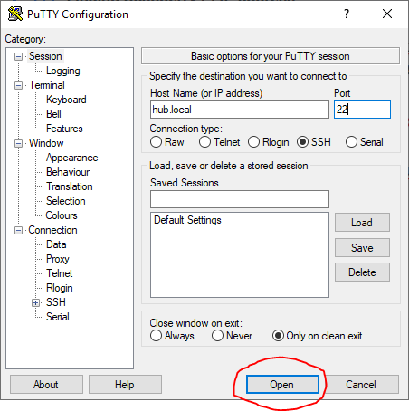

# Raspberry Pi Login

## Introduction

 This document describes how to log in to Raspberry Pi using a remote terminal via SSH protocol.


The SSH stands for "Secure Shell". In a simple way, this can be seen as a secure connection to the Raspberry Pi command line over the network.


 If you do not already have Raspberry Pi installed, first go to the document [**Raspberry Pi Installation**](raspberry-pi-installation.md).

 You can log in two ways:

## Log in via:

### IP adress

 In this case, you need to find out what address the DHCP server assigned to your Raspberry Pi.


**Finding Raspberry Pi IP address**

The client's IP address can usually be found through the configuration interface of your router in the section **DHCP Clients**, eventually **LAN Status**, etc.

On your computer use utility like [**Advanced IP scanner \(Windows\)**](http://www.advanced-ip-scanner.com/) or [**IP Scaner \(Mac\)**](https://itunes.apple.com/us/app/ip-scanner/id404167149?mt=12).

On your Android or iOS phone you can use [**Fing**](https://www.fing.io/) utility which can detect **Raspberry Pi** and show an raspberry icon with the device.


### DNS name

* For our BigClown Raspbian we are using `hub.local`
* Original Raspbian using `raspberry.local`

## Connect

### Windows

* Download the [**PuTTY**](http://www.chiark.greenend.org.uk/~sgtatham/putty/download.html) program.



Then log in with following login:

* username: `pi`
* password: `raspberry`

### Linux and macOS

* Open **Terminal** application and enter following command:
  * `ssh pi@hub.local`
  * Or with IP adress instead of DNS name `ssh pi@IP_ADRESS`insted of IP\_ADRESS fill ip adress from finder in [Introduction chapter](raspberry-pi-login.md#introduction)
* log in with following login:
  * username: `pi`
  * password: `raspberry`

## Changing the password

Remember to change the default password when you first login. You can make the change using the following command:

```text
passwd
```

## System Update

For reasons of security and stability, it is important to keep the system up to date. The system consists of packages and you can update them with the following command:

```text
sudo apt update && sudo apt upgrade
```

